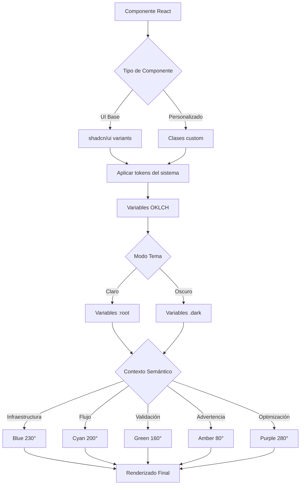
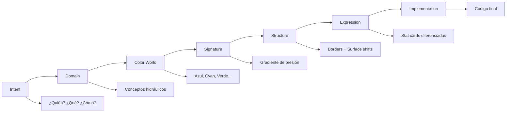

# Documento de Diseño

## Visión General

Este diseño especifica las mejoras de consistencia visual entre la página principal, el login/register y el dashboard de la aplicación de ingeniería hidráulica, además de la implementación de elementos modernos y efectos visuales avanzados. El enfoque es aplicar el sistema de diseño existente de manera uniforme sin modificar el layout actual, mejorando la jerarquía visual, el espaciado, asegurando que todos los componentes UI sean consistentes, e implementando efectos visuales modernos relacionados al dominio hidráulico.

### Objetivos

1. Unificar la aplicación de estilos del sistema de diseño en todas las páginas
2. Estandarizar componentes UI (Button, Card, Badge, Input) con los mismos estilos
3. Mejorar la jerarquía visual y el espaciado siguiendo un sistema consistente
4. Asegurar transiciones y animaciones uniformes
5. Mantener la consistencia en modo claro y oscuro
6. Aplicar principios expertos de UI/UX de la skill interface-design
7. Implementar carruseles interactivos para proyectos y testimonios
8. Crear backgrounds animados con tema hidráulico (partículas de agua, ondas, flujo)
9. Agregar scroll animations y parallax effects sutiles
10. Implementar microinteracciones en componentes interactivos
11. Crear loading states y page transitions fluidas
12. Optimizar performance y respetar preferencias de accesibilidad

### Alcance

- Página principal (`/`): frontend/src/app/page.tsx
- Login/Register (`/login`): frontend/src/app/login/page.tsx
- Dashboard (`/dashboard`): frontend/src/app/(dashboard)/dashboard/page.tsx
- Sistema de diseño: frontend/src/app/globals.css
- Componentes UI: frontend/src/components/ui/*
- Componentes personalizados: frontend/src/components/feature-card.tsx

**Fuera del alcance:**
- Modificación del layout o estructura de las páginas
- Creación de nuevos componentes
- Cambios en la funcionalidad existente

## Análisis Experto de UI/UX

### Contexto del Producto

**¿Quién es este humano?**
Ingenieros civiles e hidráulicos trabajando en diseño de redes de agua potable. Están en su oficina, probablemente entre las 8am-6pm, alternando entre cálculos técnicos, revisión normativa y documentación. Necesitan precisión, confianza y claridad. No están buscando entretenimiento—están resolviendo problemas de infraestructura crítica.

**¿Qué deben lograr?**
- **Login/Register**: Autenticarse rápidamente para acceder a sus proyectos. No es el destino, es la puerta.
- **Dashboard**: Ver estado de proyectos, iniciar nuevos cálculos, acceder a información normativa rápidamente.
- **Landing**: Entender capacidades del sistema y decidir si registrarse.

**¿Cómo debe sentirse?**
Técnico pero accesible. Preciso como un terminal de ingeniería, pero no intimidante. Confiable como una calculadora científica, pero moderno. Los colores deben evocar agua (azules, cianos) sin ser decorativos—deben significar algo (presión, flujo, validación).

### Dominio del Producto: Ingeniería Hidráulica

**Conceptos del dominio:**
1. **Flujo y presión**: El agua se mueve, tiene dirección, fuerza
2. **Redes y nodos**: Sistemas interconectados, no elementos aislados
3. **Normativa técnica**: Precisión numérica, límites claros, validación
4. **Cálculo iterativo**: Procesos que convergen, refinamiento progresivo
5. **Mapas y topografía**: Visualización espacial, cotas, elevaciones

**Mundo de colores del dominio:**
1. **Azul profundo (230°)**: Agua en reposo, tuberías, infraestructura
2. **Cian (200°)**: Flujo activo, presión dinámica
3. **Verde (160°)**: Validación normativa, rangos aceptables
4. **Ámbar (80°)**: Advertencias, límites críticos
5. **Púrpura (280°)**: Algoritmos, optimización, IA

**Firma del producto:**
Gradientes superiores en stat cards que simulan presión hidráulica—más intenso arriba (alta presión), degradando hacia abajo. Este elemento visual solo tiene sentido en un contexto hidráulico.

**Defaults a evitar:**
1. ❌ Sidebar con fondo diferente → ✅ Mismo fondo con border sutil
2. ❌ Cards con sombras dramáticas → ✅ Elevación sutil con borders OKLCH
3. ❌ Inputs con borders sólidos → ✅ Inputs "inset" con fondo más oscuro

### Estado Actual: Análisis Crítico

#### Login/Register (frontend/src/app/login/page.tsx)

**Lo que funciona bien:**
- División clara entre brand panel (izquierda) y auth form (derecha) - excelente separación de contextos
- Uso consistente de OKLCH para colores en la mayoría de elementos
- Animaciones sutiles en gradientes de fondo (mesh overlay con radial gradients)
- Feature pills que comunican capacidades técnicas de forma efectiva
- Microinteracciones en inputs (focus states con ring y border color)
- Logo con gradiente y overlay que establece identidad visual
- Toggle entre login/registro sin recargar página

**Oportunidades de mejora críticas:**

1. **Jerarquía tipográfica inconsistente y fuera del sistema**
   - Título principal: `text-[2.75rem]` (44px) - valor arbitrario, debería ser `text-5xl` (48px)
   - Labels de formulario: `text-[11px]` - demasiado pequeño, dificulta legibilidad, debería ser `text-xs` (12px)
   - Descripción hero: `text-[15px]` - valor arbitrario, debería ser `text-base` (16px)
   - Feature pills: `text-[11px]` - inconsistente con otros badges
   - Falta progresión clara del sistema: hero → section → card → label

2. **Espaciado sin sistema coherente**
   - Brand panel: `p-12` (48px)
   - Auth form: `p-6 sm:p-12` (24px/48px)
   - Feature cards: `p-3.5` (14px) - no es múltiplo de 4px
   - Pills: `px-3 py-1` vs badges: `px-2.5 py-1` - inconsistente
   - Gaps mezclados: `gap-3`, `gap-4`, `space-y-8` sin patrón claro
   - **Problema**: No sigue múltiplos de 4px consistentemente

3. **Depth strategy mezclada y confusa**
   - Brand panel: gradientes complejos + mesh overlay + grid lines + water flow
   - Auth form: texture dots + borders sutiles
   - Feature cards: `rgba(255,255,255,0.03)` - **NO es OKLCH**, rompe consistencia
   - Inputs: `oklch(0.18 0.01 260)` sobre `oklch(0.14 0.01 260)` - **INVERTIDO** (más claro en lugar de más oscuro)
   - **Problema**: Falta estrategia unificada de elevación

4. **Inputs no siguen principio "inset"**
   - Background actual: `oklch(0.18 0.01 260)` es **más claro** que el fondo `oklch(0.14 0.01 260)`
   - Debería ser: `oklch(0.12 0.01 260)` o más oscuro para señalar "tipo aquí"
   - Focus ring es correcto (`oklch(0.55 0.18 230)`) pero border base es muy sutil
   - **Problema**: Inputs parecen elevados en lugar de hundidos

5. **Botón de Google rompe completamente la paleta**
   - Background: `white` (blanco puro) - **NO pertenece al mundo de colores**
   - Text: `black` (negro puro) - **NO usa OKLCH**
   - Debería usar: `bg-elevated2` con `text-foreground` del sistema
   - **Problema**: Elemento extraño que no respeta el dominio visual

6. **Badges y pills inconsistentes entre sí**
   - Feature pills: `text-[11px]` con `px-3 py-1`
   - Norm badges (footer): `text-[10px]` con `px-2.5 py-1`
   - Status badge (plataforma activa): `text-[11px]` con `px-3 py-1`
   - **Problema**: Necesitan unificación en tamaño y padding

7. **Animaciones y efectos decorativos excesivos en brand panel**
   - 4 capas de efectos: gradiente base + mesh overlay + grid lines + water flow
   - Puede distraer del objetivo principal (autenticación)
   - **Sugerencia**: Simplificar a 2 capas máximo

8. **Contraste insuficiente en algunos textos**
   - Descripción hero: `text-white/40` (40% opacity) - puede estar bajo 4.5:1
   - Feature descriptions: `text-white/30` (30% opacity) - definitivamente bajo 4.5:1
   - Footer copyright: `text-white/20` (20% opacity) - ilegible
   - **Problema**: Viola WCAG AA para contraste de texto

#### Dashboard (frontend/src/app/(dashboard)/dashboard/page.tsx)

**Lo que funciona bien:**
- Stat cards con gradientes superiores (firma del producto) - excelente uso del signature element
- Uso de colores temáticos consistente (blue, green, amber, purple, cyan) del dominio
- Glass cards con border sutil - buena aplicación de subtle layering
- Animaciones fade-in-up con delays progresivos (0.1s, 0.2s, 0.3s)
- Badges con colores semánticos que comunican significado
- Estructura clara: header → stats → capacidades → proyectos → normativa

**Oportunidades de mejora críticas:**

1. **Stat cards: estructura y jerarquía inconsistente**
   - Primeras dos cards (Proyectos, Cálculos): valor `text-3xl` + descripción `text-[10px]`
   - Últimas tres cards (Norma, Motor, IA): valor `text-lg` + descripción `text-[10px]`
   - **Problema**: Deberían tener jerarquía uniforme - todas `text-3xl` o todas `text-lg`
   - **Sugerencia**: Unificar a `text-3xl` para valores numéricos, `text-lg` para códigos/siglas

2. **Capacidades cards: densidad desbalanceada y jerarquía débil**
   - Iconos: `w-10 h-10` - podrían ser `w-8 h-8` para dar más espacio al texto
   - Título: `text-sm` - correcto
   - Descripción: `text-xs` - **muy pequeña** para contenido importante, debería ser `text-sm`
   - Badges: `text-[10px]` - al límite de legibilidad, debería ser `text-xs` (12px)
   - **Problema**: Texto importante es difícil de leer

3. **Normativa quick reference: falta cohesión y contexto visual**
   - Cards individuales sin relación visual clara entre sí
   - Valores grandes (`text-2xl md:text-3xl`) pero sin contexto visual (barras, indicadores)
   - Hover effect igual para todas - no diferencia importancia relativa
   - **Sugerencia**: Agregar barras de progreso o indicadores visuales para rangos (10-50 m.c.a.)
   - **Sugerencia**: Usar diferentes intensidades de hover según criticidad

4. **Proyectos recientes: jerarquía plana y falta de énfasis**
   - Nombre del proyecto y metadata tienen peso visual similar
   - Status dot: `w-2 h-2` - muy sutil, difícil de ver
   - Fecha en `font-mono` - no aporta (no es dato técnico que requiera monospace)
   - Badge de ámbito: `text-[10px] h-4 px-1.5` - demasiado pequeño
   - **Problema**: Difícil identificar rápidamente el proyecto más importante

5. **Botones primarios duplicados con estilos inconsistentes**
   - Header: "Nuevo Proyecto" con `btn-primary` + clases adicionales
   - Empty state: "Crear Primer Proyecto" con `btn-primary` + clases adicionales
   - **Problema**: Deberían tener exactamente las mismas clases
   - **Actual**: Ambos tienen clases ligeramente diferentes

6. **Spacing inconsistente con login y landing**
   - Dashboard: `p-6 md:p-8` (24px/32px)
   - Login: `p-12` (48px)
   - Landing: `px-6 md:px-12` (24px/48px)
   - **Problema**: Deberían seguir el mismo sistema de espaciado
   - **Sugerencia**: Unificar a `p-6 md:p-8` para secciones internas

7. **Empty state poco atractivo**
   - Icono: `w-16 h-16` con emoji 💧 - funcional pero básico
   - Texto: correcto pero sin jerarquía clara
   - Botón: correcto
   - **Sugerencia**: Agregar ilustración o animación sutil para hacer más atractivo

8. **Falta de feedback visual en acciones**
   - Cards de proyectos tienen hover pero no indican que son clickeables
   - Botones tienen hover pero falta loading state visible
   - **Sugerencia**: Agregar cursor pointer y loading spinners

#### Comparación con Landing Page (frontend/src/app/page.tsx)

**Consistencias positivas:**
- Uso de OKLCH en colores
- Glass cards con borders sutiles
- Animaciones fade-in-up
- Badges con colores semánticos
- Normativa quick reference con mismo formato

**Inconsistencias detectadas:**
1. **Spacing**: Landing usa `px-6 md:px-12 pt-32 pb-16`, Dashboard usa `p-6 md:p-8`
2. **Typography**: Landing usa `text-4xl md:text-6xl lg:text-7xl`, Login usa `text-[2.75rem]`
3. **Buttons**: Landing usa `h-14 px-8 text-lg`, Login/Dashboard usan `h-11 md:h-12 px-6 md:px-8`
4. **Cards**: Landing usa `rounded-2xl`, Dashboard usa `rounded-xl`
5. **Badges**: Landing usa `text-xs`, Login/Dashboard usan `text-[10px]` y `text-[11px]`

### Propuestas Concretas de Mejora

#### Login/Register: Mejoras Prioritarias

**1. Unificar jerarquía tipográfica al sistema**
```typescript
// ❌ Actual (valores arbitrarios)
<h1 className="text-[2.75rem]">  // 44px
<label className="text-[11px]">  // 11px
<p className="text-[15px]">       // 15px

// ✅ Propuesto (sistema consistente)
<h1 className="text-5xl md:text-6xl">  // 48px/60px
<label className="text-xs">             // 12px
<p className="text-base">                // 16px
```

**2. Corregir inputs para seguir principio "inset"**
```typescript
// ❌ Actual (input más claro que fondo)
style={{ background: 'oklch(0.18 0.01 260)' }}  // sobre oklch(0.14 0.01 260)

// ✅ Propuesto (input más oscuro = "hundido")
className="bg-[oklch(0.12_0.01_260)]"  // más oscuro que el fondo
```

**3. Reemplazar botón de Google con estilo del sistema**
```typescript
// ❌ Actual (rompe paleta)
style={{ background: 'white', color: 'black' }}

// ✅ Propuesto (respeta dominio)
className="bg-elevated2 text-foreground border border-border/30 hover:bg-elevated3"
```

**4. Unificar badges y pills**
```typescript
// ✅ Estándar unificado
const badgeStyles = "text-xs px-3 py-1 rounded-full"  // 12px, padding consistente
```

**5. Simplificar efectos decorativos en brand panel**
```typescript
// ❌ Actual (4 capas)
- Gradiente base
- Mesh overlay
- Grid lines
- Water flow

// ✅ Propuesto (2 capas)
- Gradiente base con mesh integrado
- Subtle texture (eliminar grid y water flow)
```

**6. Mejorar contraste de textos**
```typescript
// ❌ Actual (bajo contraste)
<p className="text-white/40">  // 40% - puede estar bajo 4.5:1
<p className="text-white/30">  // 30% - definitivamente bajo 4.5:1
<p className="text-white/20">  // 20% - ilegible

// ✅ Propuesto (WCAG AA compliant)
<p className="text-white/70">  // 70% - cumple 4.5:1
<p className="text-white/60">  // 60% - cumple 4.5:1
<p className="text-white/50">  // 50% - mínimo para texto secundario
```

**7. Estandarizar espaciado a múltiplos de 4px**
```typescript
// ❌ Actual (valores inconsistentes)
className="p-3.5"  // 14px - no es múltiplo de 4
className="px-2.5" // 10px - no es múltiplo de 4

// ✅ Propuesto (múltiplos de 4px)
className="p-4"    // 16px
className="px-3"   // 12px
```

#### Dashboard: Mejoras Prioritarias

**1. Unificar estructura de stat cards**
```typescript
// ❌ Actual (inconsistente)
// Proyectos/Cálculos: text-3xl
// Norma/Motor/IA: text-lg

// ✅ Propuesto (consistente por tipo)
interface StatCardStructure {
  numeric: {
    value: 'text-3xl font-bold',      // Para contadores (Proyectos, Cálculos)
    label: 'text-xs uppercase',
    description: 'text-xs'             // Aumentado de text-[10px]
  },
  reference: {
    value: 'text-lg font-bold',        // Para códigos (OS.050, Hardy Cross)
    label: 'text-xs uppercase',
    description: 'text-xs'
  }
}
```

**2. Mejorar densidad de capacidades cards**
```typescript
// ❌ Actual (texto muy pequeño)
icon: 'w-10 h-10'
description: 'text-xs'
badges: 'text-[10px]'

// ✅ Propuesto (más legible)
icon: 'w-8 h-8'           // Más compacto
description: 'text-sm'    // Aumentado para legibilidad
badges: 'text-xs'         // Aumentado de 10px a 12px
```

**3. Agregar contexto visual a normativa cards**
```typescript
// ✅ Nuevo: Indicador de rango visual
<div className="mt-3 h-1.5 rounded-full bg-muted-foreground/10 overflow-hidden">
  <div 
    className="h-full rounded-full bg-blue-500 transition-all duration-500"
    style={{ width: `${(value - min) / (max - min) * 100}%` }}
  />
</div>

// Ejemplo: 10-50 m.c.a. → valor 10 = 0%, valor 30 = 50%, valor 50 = 100%
```

**4. Mejorar jerarquía en proyectos recientes**
```typescript
// ❌ Actual (jerarquía plana)
statusDot: 'w-2 h-2'
title: 'font-medium text-sm'
badge: 'text-[10px] h-4'

// ✅ Propuesto (jerarquía clara)
statusDot: 'w-2.5 h-2.5 shadow-sm shadow-{color}/50'  // Más visible
title: 'font-semibold text-base'                       // Más prominente
badge: 'text-xs h-5'                                   // Más legible
```

**5. Unificar botones primarios**
```typescript
// ✅ Componente reutilizable
const PrimaryButton = () => (
  <Button className="btn-primary text-white rounded-xl h-11 md:h-12 px-6 md:px-8 font-semibold hover:shadow-lg hover:shadow-blue-500/40 hover:-translate-y-1 transition-all duration-200">
    {children}
  </Button>
)

// Usar en header y empty state con mismas clases exactas
```

**6. Estandarizar spacing con login y landing**
```typescript
// ✅ Sistema unificado de spacing
const sectionSpacing = {
  internal: 'p-6 md:p-8',        // Dashboard, secciones internas
  hero: 'px-6 md:px-12 pt-32',   // Landing hero
  auth: 'p-6 md:p-12',           // Login/Register
}
```

**7. Mejorar empty state**
```typescript
// ✅ Empty state más atractivo
<div className="text-center py-16">
  <div className="w-20 h-20 rounded-2xl bg-primary/5 flex items-center justify-center text-4xl mx-auto mb-4 animate-pulse">
    💧
  </div>
  <h3 className="text-lg font-semibold mb-2">Sin proyectos aún</h3>
  <p className="text-sm text-muted-foreground/70 mb-6">
    Comienza diseñando tu primera red de agua potable
  </p>
  <PrimaryButton>Crear Primer Proyecto</PrimaryButton>
</div>
```

**8. Agregar feedback visual en acciones**
```typescript
// ✅ Loading states y cursors
<Link 
  href={`/proyectos/${proyecto.id}`}
  className="... cursor-pointer"  // Agregar cursor
>
  ...
</Link>

<Button 
  disabled={loading}
  className="..."
>
  {loading ? (
    <>
      <Loader2 className="w-4 h-4 animate-spin mr-2" />
      Cargando...
    </>
  ) : (
    'Nuevo Proyecto'
  )}
</Button>
```

#### Consistencia Cross-Page: Unificación Global

**1. Sistema de tipografía unificado**
```typescript
// Aplicar en todas las páginas
const typography = {
  hero: {
    title: 'text-5xl md:text-6xl font-bold tracking-tight',
    subtitle: 'text-base md:text-lg text-muted-foreground/70'
  },
  section: {
    title: 'text-2xl md:text-3xl font-bold tracking-tight',
    subtitle: 'text-sm text-muted-foreground/60'
  },
  card: {
    title: 'text-base font-semibold',
    description: 'text-sm text-muted-foreground/70',
    metadata: 'text-xs text-muted-foreground/50'
  },
  label: {
    form: 'text-xs font-medium uppercase tracking-wider',
    badge: 'text-xs font-medium'  // Unificado a 12px
  }
}
```

**2. Sistema de spacing unificado**
```typescript
// Aplicar en todas las páginas
const spacing = {
  section: 'p-6 md:p-8',           // Secciones internas
  hero: 'px-6 md:px-12 pt-32',     // Hero sections
  card: 'p-5',                     // Cards estándar
  cardCompact: 'p-4',              // Cards compactas
  button: 'px-6 py-3',             // Botones estándar
  buttonLarge: 'px-8 py-3',        // Botones hero
  gap: {
    micro: 'gap-1',    // 4px
    small: 'gap-2',    // 8px
    medium: 'gap-3',   // 12px
    large: 'gap-4',    // 16px
    section: 'gap-6',  // 24px
  }
}
```

**3. Sistema de borders y radius unificado**
```typescript
// Aplicar en todas las páginas
const borders = {
  radius: {
    button: 'rounded-xl',      // 12px - todos los botones
    card: 'rounded-xl',        // 12px - cards estándar
    cardLarge: 'rounded-2xl',  // 16px - cards hero
    input: 'rounded-xl',       // 12px - inputs
    badge: 'rounded-full',     // Badges y pills
  },
  width: {
    subtle: 'border border-border/20',
    standard: 'border border-border/30',
    emphasis: 'border border-primary/30',
  }
}
```

**4. Sistema de colores OKLCH unificado**
```typescript
// Eliminar todos los rgba() y hex, usar solo OKLCH
const colors = {
  surfaces: {
    base: 'oklch(0.14 0.01 260)',
    elevated1: 'oklch(0.16 0.01 260)',
    elevated2: 'oklch(0.18 0.01 260)',
    elevated3: 'oklch(0.20 0.01 260)',
  },
  borders: {
    subtle: 'oklch(0.25 0.02 260 / 0.2)',
    standard: 'oklch(0.25 0.02 260 / 0.3)',
    emphasis: 'oklch(0.55 0.18 230 / 0.3)',
  },
  text: {
    primary: 'oklch(0.93 0.01 250)',
    secondary: 'oklch(0.93 0.01 250 / 0.7)',
    tertiary: 'oklch(0.93 0.01 250 / 0.5)',
    muted: 'oklch(0.93 0.01 250 / 0.4)',
  }
}
```

### Principios de Diseño Aplicados

#### 1. Subtle Layering (Elevación de Superficies)

**Sistema de elevación propuesto:**

```typescript
const surfaces = {
  base: 'oklch(0.14 0.01 260)',      // Canvas principal
  elevated1: 'oklch(0.16 0.01 260)', // Cards, inputs
  elevated2: 'oklch(0.18 0.01 260)', // Dropdowns, tooltips
  elevated3: 'oklch(0.20 0.01 260)', // Modals
}

const borders = {
  subtle: 'oklch(0.25 0.02 260 / 0.2)',    // Separación suave
  standard: 'oklch(0.25 0.02 260 / 0.3)',  // Borders normales
  emphasis: 'oklch(0.55 0.18 230 / 0.3)',  // Hover, active
  focus: 'oklch(0.55 0.18 230)',           // Focus ring
}
```

**Aplicación:**
- Sidebar: mismo background que canvas, border sutil
- Cards: elevated1 con border standard
- Inputs: elevated1 (más oscuro que su contenedor) con border subtle
- Dropdowns: elevated2 sobre cards

#### 2. Token Architecture (Arquitectura de Tokens)

**Jerarquía de texto:**

```typescript
const typography = {
  hero: {
    title: 'text-5xl md:text-6xl font-bold tracking-tight',     // 48-60px
    subtitle: 'text-base md:text-lg text-muted-foreground/70'   // 16-18px
  },
  section: {
    title: 'text-2xl md:text-3xl font-bold tracking-tight',     // 24-30px
    subtitle: 'text-sm text-muted-foreground/60'                // 14px
  },
  card: {
    title: 'text-base font-semibold',                           // 16px
    description: 'text-sm text-muted-foreground/70',            // 14px
    metadata: 'text-xs text-muted-foreground/50'                // 12px
  },
  stat: {
    value: 'text-3xl font-bold',                                // 30px
    label: 'text-xs font-medium uppercase tracking-wider',      // 12px
    unit: 'text-sm text-muted-foreground'                       // 14px
  },
  label: {
    form: 'text-xs font-medium uppercase tracking-wider',       // 12px
    badge: 'text-[10px] font-medium'                            // 10px (mínimo)
  }
}
```

**Sistema de espaciado (múltiplos de 4px):**

```typescript
const spacing = {
  micro: 'gap-1',      // 4px - icon gaps
  small: 'gap-2',      // 8px - badge padding
  medium: 'gap-3',     // 12px - card internal spacing
  large: 'gap-4',      // 16px - between cards
  section: 'gap-6',    // 24px - between sections
  major: 'gap-8',      // 32px - major separations
  
  padding: {
    input: 'px-4 py-3',      // 16px/12px
    button: 'px-6 py-3',     // 24px/12px
    card: 'p-5',             // 20px
    section: 'p-6 md:p-8'    // 24px/32px
  }
}
```

#### 3. Color Lives Somewhere (Color con Significado)

**Paleta temática del dominio:**

```typescript
const themeColors = {
  // Infraestructura (azul profundo)
  infrastructure: {
    hue: 230,
    chroma: 0.18,
    light: 0.55,
    dark: 0.65,
    use: 'Tuberías, proyectos, estructura principal'
  },
  
  // Flujo activo (cian)
  flow: {
    hue: 200,
    chroma: 0.15,
    light: 0.60,
    dark: 0.70,
    use: 'Cálculos activos, simulaciones, IA'
  },
  
  // Validación (verde)
  validation: {
    hue: 160,
    chroma: 0.15,
    light: 0.55,
    dark: 0.65,
    use: 'Normas cumplidas, rangos aceptables'
  },
  
  // Advertencia (ámbar)
  warning: {
    hue: 80,
    chroma: 0.16,
    light: 0.65,
    dark: 0.75,
    use: 'Límites críticos, valores fuera de rango'
  },
  
  // Optimización (púrpura)
  optimization: {
    hue: 280,
    chroma: 0.18,
    light: 0.55,
    dark: 0.60,
    use: 'Algoritmos genéticos, optimización'
  }
}
```

**Reglas de uso:**
- Color = significado, no decoración
- Un color por contexto semántico
- Gradientes solo donde simulan fenómeno físico (presión hidráulica)
- Backgrounds neutros (grises OKLCH), color solo en accents

#### 4. Depth Strategy (Estrategia de Profundidad)

**Enfoque elegido: Borders + Subtle Surface Shifts**

Razón: Herramienta técnica requiere claridad, no dramatismo. Borders definen estructura sin distraer. Surface shifts establecen jerarquía sin sombras pesadas.

```typescript
const depth = {
  card: {
    base: 'border border-border/20',
    hover: 'hover:border-primary/30',
    active: 'border-primary/50'
  },
  
  input: {
    base: 'border border-border/20',
    focus: 'border-primary ring-4 ring-primary/10'
  },
  
  button: {
    primary: 'shadow-sm shadow-primary/20',
    hover: 'hover:shadow-md hover:shadow-primary/30'
  }
}
```

**No usar:**
- Sombras dramáticas (box-shadow con blur > 24px)
- Múltiples sombras apiladas
- Sombras de colores saturados

#### 5. Infinite Expression (Expresión Infinita)

**Stat cards: 5 expresiones diferentes**

Aunque todas son "metric displays", cada una debe expresarse según su contenido:

1. **Proyectos** (contador): Número grande + label + descripción
2. **Cálculos** (contador): Número grande + label + descripción
3. **Norma** (referencia): Código + label + versión
4. **Motor** (tecnología): Nombre + label + método
5. **IA** (stack): Siglas + label + componentes

No todas deben verse iguales—el contenido dicta la estructura.

**Normativa cards: Expresión como indicadores**

En lugar de solo mostrar números, agregar contexto visual:
- Barra de progreso para rangos (ej: 10-50 m.c.a.)
- Indicador de cumplimiento (✓ o ⚠)
- Comparación visual entre valores

### Signature Element: Gradientes de Presión Hidráulica

**Elemento único del producto:**

Los gradientes superiores en stat cards no son decorativos—simulan presión hidráulica. Más intenso arriba (alta presión), degradando hacia abajo (baja presión). Este elemento visual solo tiene sentido en un contexto de ingeniería hidráulica.

**Implementación:**

```css
.stat-card::before {
  content: '';
  position: absolute;
  top: 0;
  left: 0;
  right: 0;
  height: 3px;
  background: linear-gradient(90deg, 
    oklch(var(--color-l) var(--color-c) var(--color-h)), 
    oklch(calc(var(--color-l) + 0.05) calc(var(--color-c) - 0.03) var(--color-h))
  );
  border-radius: inherit;
  border-bottom-left-radius: 0;
  border-bottom-right-radius: 0;
}
```

**Extensión a otros elementos:**

- Progress bars: gradiente horizontal (flujo)
- Loading states: gradiente animado (flujo en movimiento)
- Validation indicators: gradiente vertical (presión)

## Arquitectura

### Estructura del Sistema de Diseño

```
Sistema de Diseño (globals.css)
├── Variables OKLCH (modo claro/oscuro)
│   ├── Surfaces (base, elevated1-3)
│   ├── Borders (subtle, standard, emphasis, focus)
│   ├── Text (primary, secondary, tertiary, muted)
│   └── Semantic (infrastructure, flow, validation, warning, optimization)
├── Efectos de Fondo
│   ├── water-bg (gradientes animados)
│   └── water-bubble (partículas flotantes)
├── Efectos de Tarjetas
│   ├── glass-card (glassmorphism)
│   └── stat-card-* (tarjetas estadísticas temáticas con gradiente de presión)
├── Gradientes
│   ├── text-gradient (texto)
│   ├── btn-primary (botones)
│   └── pressure-gradient (signature: presión hidráulica)
├── Animaciones
│   ├── fade-in-up (entrada de elementos)
│   ├── waterFlow (fondo animado)
│   └── floatUp (burbujas)
├── Estados Interactivos
│   ├── hover (transformaciones sutiles)
│   ├── focus (ring + border)
│   └── active (border emphasis)
└── Typography Scale
    ├── Hero (title, subtitle)
    ├── Section (title, subtitle)
    ├── Card (title, description, metadata)
    ├── Stat (value, label, unit)
    └── Label (form, badge)
```

### Flujo de Aplicación de Estilos



### Jerarquía de Decisiones de Diseño



## Componentes e Interfaces

### 1. Sistema de Tokens de Diseño

#### Espaciado Consistente

```typescript
// Sistema de espaciado basado en múltiplos de 4px
const spacing = {
  micro: 'gap-1',                       // 4px - icon gaps, tight spacing
  small: 'gap-2',                       // 8px - badge padding, compact elements
  medium: 'gap-3',                      // 12px - card internal spacing
  large: 'gap-4',                       // 16px - between cards
  section: 'gap-6',                     // 24px - between sections
  major: 'gap-8',                       // 32px - major separations
  
  padding: {
    input: 'px-4 py-3',                 // 16px/12px - comfortable hit area
    button: 'px-6 py-3',                // 24px/12px - prominent actions
    buttonLarge: 'px-8 py-3',           // 32px/12px - hero CTAs
    card: 'p-5',                        // 20px - standard card padding
    cardCompact: 'p-4',                 // 16px - dense cards
    section: 'p-6 md:p-8',              // 24px/32px - page sections
    sectionLarge: 'p-8 md:p-12'         // 32px/48px - hero sections
  },
  
  margin: {
    element: 'mb-2',                    // 8px - between related elements
    group: 'mb-4',                      // 16px - between groups
    section: 'mb-6 md:mb-8',            // 24px/32px - between sections
    major: 'mb-12 md:mb-16'             // 48px/64px - major separations
  }
}
```

#### Jerarquía Tipográfica

```typescript
const typography = {
  hero: {
    title: 'text-5xl md:text-6xl font-bold tracking-tight',
    subtitle: 'text-base md:text-lg text-muted-foreground/70',
    description: 'text-sm md:text-base text-muted-foreground/60'
  },
  section: {
    title: 'text-2xl md:text-3xl font-bold tracking-tight',
    subtitle: 'text-sm text-muted-foreground/60',
    description: 'text-sm text-muted-foreground/70'
  },
  card: {
    title: 'text-base font-semibold',
    description: 'text-sm text-muted-foreground/70',
    metadata: 'text-xs text-muted-foreground/50'
  },
  stat: {
    value: 'text-3xl font-bold',
    label: 'text-xs font-medium text-muted-foreground uppercase tracking-wider',
    unit: 'text-sm font-normal text-muted-foreground',
    description: 'text-[10px] text-muted-foreground/60'
  },
  label: {
    form: 'text-xs font-medium uppercase tracking-wider text-muted-foreground',
    badge: 'text-[10px] font-medium',
    metadata: 'text-[10px] text-muted-foreground/40'
  }
}
```

### 2. Componentes UI Estandarizados

#### Button Component

```typescript
interface ButtonStyles {
  primary: {
    base: 'btn-primary text-white rounded-xl h-12 px-6 md:px-8 font-semibold',
    hover: 'hover:shadow-md hover:shadow-primary/30 hover:-translate-y-0.5',
    transition: 'transition-all duration-200',
    focus: 'focus:ring-4 focus:ring-primary/10 focus:outline-none'
  },
  secondary: {
    base: 'rounded-xl h-12 px-6 md:px-8 font-medium',
    style: 'bg-primary/10 text-primary border border-primary/20',
    hover: 'hover:bg-primary/15 hover:border-primary/30',
    transition: 'transition-all duration-200'
  },
  ghost: {
    base: 'rounded-xl h-12 px-6 md:px-8 font-medium',
    style: 'text-muted-foreground',
    hover: 'hover:text-foreground hover:bg-accent/20',
    transition: 'transition-all duration-200'
  },
  social: {
    base: 'w-full h-12 rounded-xl font-medium flex items-center justify-center gap-3',
    style: 'bg-white text-black',
    hover: 'hover:bg-gray-50',
    transition: 'transition-all duration-200',
    shadow: 'shadow-sm shadow-black/10'
  }
}
```

#### Input Component

```typescript
interface InputStyles {
  base: {
    wrapper: 'space-y-1.5',
    label: 'text-xs font-medium uppercase tracking-wider text-muted-foreground',
    input: 'w-full h-12 px-4 rounded-xl text-sm text-foreground placeholder:text-muted-foreground/30',
    background: 'bg-elevated1',  // Más oscuro que el contenedor (inset)
    border: 'border border-border/20',
    transition: 'transition-all duration-200'
  },
  states: {
    focus: 'focus:border-primary focus:ring-4 focus:ring-primary/10 focus:outline-none',
    error: 'border-destructive/50 focus:border-destructive focus:ring-destructive/10',
    disabled: 'opacity-50 cursor-not-allowed'
  },
  variants: {
    password: {
      wrapper: 'relative',
      toggle: 'absolute right-3.5 top-1/2 -translate-y-1/2 text-muted-foreground/40 hover:text-muted-foreground/70 transition-colors'
    }
  }
}
```

#### Card Component

```typescript
interface CardStyles {
  glass: {
    base: 'glass-card rounded-xl md:rounded-2xl',
    background: 'bg-elevated1',
    border: 'border border-border/20',
    padding: 'p-5 md:p-6',
    hover: 'hover:border-primary/30 hover:shadow-lg',
    transition: 'transition-all duration-300'
  },
  stat: {
    base: 'stat-card bg-elevated1 rounded-xl relative overflow-hidden',
    padding: 'p-5',
    hover: 'hover:-translate-y-1 hover:shadow-xl hover:border-primary/30',
    transition: 'transition-all duration-300',
    gradient: '::before pseudo-element con gradiente de presión superior'
  },
  feature: {
    base: 'glass-card rounded-xl',
    background: 'bg-elevated1',
    border: 'border border-border/20',
    padding: 'p-5',
    hover: 'hover:border-primary/30',
    transition: 'transition-all duration-300',
    icon: 'w-10 h-10 rounded-xl flex items-center justify-center text-xl',
    iconBg: 'bg-primary/10'
  },
  project: {
    base: 'rounded-xl',
    background: 'bg-elevated1',
    border: 'border border-border/20',
    padding: 'p-4',
    hover: 'hover:border-primary/30 hover:bg-accent/20',
    transition: 'transition-all duration-200'
  }
}
```

#### Badge Component

```typescript
interface BadgeStyles {
  outline: {
    base: 'text-[10px] font-medium border rounded-full',
    padding: 'px-2 py-0.5',
    border: 'border-border/30'
  },
  themed: {
    infrastructure: 'border-blue-500/30 text-blue-400',
    flow: 'border-cyan-500/30 text-cyan-400',
    validation: 'border-green-500/30 text-green-400',
    warning: 'border-amber-500/30 text-amber-400',
    optimization: 'border-purple-500/30 text-purple-400'
  },
  status: {
    active: 'bg-green-500/15 border-green-500/30 text-green-400',
    draft: 'bg-muted-foreground/10 border-muted-foreground/20 text-muted-foreground/60',
    error: 'bg-destructive/15 border-destructive/30 text-destructive'
  },
  pill: {
    base: 'inline-flex items-center gap-2 px-3 py-1 rounded-full text-[11px] font-medium tracking-wide',
    background: 'bg-primary/15',
    border: 'border border-primary/20',
    color: 'text-primary'
  }
}
```

### 3. Componentes Específicos de Login/Register

#### Brand Panel (Left Side)

```typescript
interface BrandPanelStyles {
  container: {
    base: 'hidden lg:flex lg:w-[55%] relative overflow-hidden',
    background: 'linear-gradient(135deg, oklch(0.18 0.04 250), oklch(0.13 0.03 260), oklch(0.10 0.02 240))',
    padding: 'p-12',
    layout: 'flex flex-col justify-between'
  },
  
  logo: {
    wrapper: 'flex items-center gap-3',
    icon: 'w-11 h-11 rounded-xl flex items-center justify-center text-white font-bold text-xl relative overflow-hidden',
    iconBg: 'linear-gradient(135deg, oklch(0.60 0.20 230), oklch(0.65 0.18 200))',
    title: 'text-white/90 font-semibold text-lg tracking-tight',
    subtitle: 'text-white/30 text-[10px] font-medium tracking-[0.15em] uppercase'
  },
  
  hero: {
    wrapper: 'space-y-8 max-w-lg',
    badge: 'inline-flex items-center gap-2 px-3 py-1 rounded-full text-[11px] font-medium tracking-wide',
    badgeBg: 'bg-primary/15 border border-primary/20 text-primary',
    title: 'text-5xl md:text-6xl leading-[1.1] font-bold text-white tracking-tight',
    titleAccent: 'text-primary',
    description: 'text-white/40 text-sm md:text-base leading-relaxed'
  },
  
  features: {
    grid: 'grid grid-cols-2 gap-3',
    card: 'flex items-start gap-3 p-4 rounded-xl bg-white/3 border border-white/6 transition-colors',
    icon: 'text-lg mt-0.5',
    title: 'text-white/80 text-sm font-medium',
    description: 'text-white/30 text-xs'
  },
  
  footer: {
    wrapper: 'flex items-center justify-between',
    badges: 'flex items-center gap-4',
    badge: 'text-[10px] font-medium px-2.5 py-1 rounded-md bg-white/4 text-white/30 border border-white/6',
    copyright: 'text-white/20 text-[10px]'
  }
}
```

#### Auth Form (Right Side)

```typescript
interface AuthFormStyles {
  container: {
    base: 'flex-1 flex items-center justify-center relative',
    background: 'bg-base',
    padding: 'p-6 sm:p-12'
  },
  
  form: {
    wrapper: 'relative z-10 w-full max-w-[380px] space-y-8',
    header: 'space-y-2',
    title: 'text-2xl md:text-3xl font-bold tracking-tight',
    subtitle: 'text-sm text-muted-foreground/60'
  },
  
  divider: {
    wrapper: 'flex items-center gap-4',
    line: 'flex-1 h-px bg-border/30',
    text: 'text-[11px] text-muted-foreground/40'
  },
  
  alert: {
    error: 'flex items-start gap-3 p-4 rounded-xl bg-destructive/15 border border-destructive/25 text-destructive text-sm',
    success: 'flex items-start gap-3 p-4 rounded-xl bg-green-500/15 border border-green-500/25 text-green-400 text-sm',
    icon: 'text-base mt-0.5'
  },
  
  footer: {
    wrapper: 'space-y-3 pt-2',
    norms: 'flex items-center justify-center gap-1.5',
    norm: 'text-[10px] text-muted-foreground/40',
    separator: 'text-muted-foreground/10 mx-1.5',
    description: 'text-center text-[10px] text-muted-foreground/30',
    link: 'text-[11px] font-medium text-primary/70 hover:text-primary transition-colors'
  }
}
```

### 4. Componentes Específicos de Dashboard

#### Stat Cards Temáticas

```typescript
interface StatCardConfig {
  colors: {
    infrastructure: {
      gradient: 'linear-gradient(90deg, oklch(0.65 0.20 230), oklch(0.70 0.15 200))',
      text: 'text-blue-600 dark:text-blue-400',
      hover: 'hover:border-blue-500/30',
      hue: 230
    },
    flow: {
      gradient: 'linear-gradient(90deg, oklch(0.70 0.15 200), oklch(0.75 0.12 180))',
      text: 'text-cyan-600 dark:text-cyan-400',
      hover: 'hover:border-cyan-500/30',
      hue: 200
    },
    validation: {
      gradient: 'linear-gradient(90deg, oklch(0.65 0.18 160), oklch(0.70 0.15 140))',
      text: 'text-green-600 dark:text-green-400',
      hover: 'hover:border-green-500/30',
      hue: 160
    },
    warning: {
      gradient: 'linear-gradient(90deg, oklch(0.75 0.16 80), oklch(0.80 0.14 60))',
      text: 'text-amber-600 dark:text-amber-400',
      hover: 'hover:border-amber-500/30',
      hue: 80
    },
    optimization: {
      gradient: 'linear-gradient(90deg, oklch(0.60 0.22 280), oklch(0.65 0.18 260))',
      text: 'text-purple-600 dark:text-purple-400',
      hover: 'hover:border-purple-500/30',
      hue: 280
    }
  },
  
  structure: {
    wrapper: 'stat-card stat-card-{color} bg-elevated1 relative overflow-hidden',
    content: 'p-5',
    label: 'text-xs font-medium text-muted-foreground uppercase tracking-wider',
    value: 'text-3xl font-bold mt-2 {colorText}',
    unit: 'text-sm font-normal text-muted-foreground',
    description: 'text-[10px] text-muted-foreground/60 mt-1'
  },
  
  // Signature: Gradiente de presión hidráulica
  pressureGradient: {
    pseudo: '::before',
    position: 'absolute top-0 left-0 right-0',
    height: 'h-[3px]',
    gradient: 'linear-gradient(90deg, {color}, {colorLighter})',
    meaning: 'Simula presión hidráulica: más intenso arriba (alta presión), degradando hacia abajo'
  }
}
```

#### Normativa Quick Reference Cards

```typescript
interface NormativeCardStyles {
  base: {
    wrapper: 'p-5 rounded-xl glass-card border border-border/20 text-center group',
    hover: 'hover:border-{color}/30 hover:shadow-lg',
    transition: 'transition-all duration-300'
  },
  
  content: {
    label: 'text-[10px] font-semibold text-muted-foreground/50 uppercase tracking-wider',
    value: 'text-2xl md:text-3xl font-bold mt-1 {colorText}',
    unit: 'text-sm font-normal text-muted-foreground',
    description: 'text-[10px] text-muted-foreground/40 mt-0.5'
  },
  
  // Mejora: Agregar indicador visual
  indicator: {
    wrapper: 'mt-3 h-1.5 rounded-full bg-muted-foreground/10 overflow-hidden',
    fill: 'h-full rounded-full bg-{color} transition-all duration-500',
    width: 'Calculado según rango (ej: 10-50 m.c.a. → 20%)'
  }
}
```

#### Project List Item

```typescript
interface ProjectListItemStyles {
  base: {
    wrapper: 'flex items-center justify-between p-4 rounded-xl border border-border/20 group',
    hover: 'hover:border-primary/30 hover:bg-accent/20',
    transition: 'transition-all duration-200'
  },
  
  content: {
    wrapper: 'flex items-center gap-3',
    statusDot: 'w-2 h-2 rounded-full',
    statusActive: 'bg-green-500 shadow-sm shadow-green-500/50',
    statusDraft: 'bg-muted-foreground/30',
    title: 'font-medium text-sm group-hover:text-primary transition-colors',
    metadata: 'flex items-center gap-2 mt-0.5'
  },
  
  badge: {
    base: 'text-[10px] h-4 px-1.5 border-border/30',
    type: 'text-muted-foreground/50'
  },
  
  date: {
    base: 'text-[10px] text-muted-foreground/40',
    format: 'dd/mm/yyyy'
  }
}
```

## Modelos de Datos

### Configuración de Tema

```typescript
interface ThemeConfig {
  mode: 'light' | 'dark'
  colors: {
    oklch: {
      light: {
        background: 'oklch(1 0 0)',
        foreground: 'oklch(0.145 0 0)',
        primary: 'oklch(0.205 0 0)',
        // ... resto de variables
      },
      dark: {
        background: 'oklch(0.11 0.01 250)',
        foreground: 'oklch(0.93 0.01 250)',
        primary: 'oklch(0.65 0.18 230)',
        // ... resto de variables
      }
    }
  }
}
```

### Configuración de Componente

```typescript
interface ComponentConfig {
  type: 'button' | 'card' | 'badge' | 'stat-card'
  variant: string
  size?: 'xs' | 'sm' | 'default' | 'lg'
  color?: 'blue' | 'green' | 'amber' | 'purple' | 'cyan'
  styles: {
    base: string[]
    hover?: string[]
    focus?: string[]
    active?: string[]
  }
  animation?: {
    type: 'fade-in-up' | 'hover' | 'none'
    delay?: number
  }
}
```

### Estructura de Página

```typescript
interface PageStructure {
  sections: Section[]
  theme: ThemeConfig
  animations: AnimationConfig
}

interface Section {
  id: string
  type: 'hero' | 'stats' | 'features' | 'content'
  spacing: {
    paddingY: string
    marginBottom: string
    gap: string
  }
  components: ComponentConfig[]
}
```

## Componentes Modernos y Efectos Visuales

### 5. Carrusel de Proyectos Destacados

#### Diseño del Carrusel

El carrusel de proyectos utiliza una biblioteca moderna como **Embla Carousel** o **Swiper** para garantizar performance y accesibilidad.

```typescript
interface CarouselConfig {
  container: {
    wrapper: 'relative w-full overflow-hidden',
    viewport: 'overflow-hidden',
    container: 'flex gap-4 md:gap-6',
    slide: 'flex-[0_0_100%] md:flex-[0_0_calc(50%-12px)] lg:flex-[0_0_calc(33.333%-16px)] min-w-0'
  },
  
  navigation: {
    arrows: {
      base: 'absolute top-1/2 -translate-y-1/2 z-10 w-12 h-12 rounded-full',
      style: 'bg-elevated2/80 backdrop-blur-sm border border-border/30',
      hover: 'hover:bg-elevated3 hover:border-primary/30 hover:scale-110',
      transition: 'transition-all duration-200',
      icon: 'text-foreground/70 hover:text-primary',
      prev: 'left-4',
      next: 'right-4'
    },
    dots: {
      wrapper: 'flex items-center justify-center gap-2 mt-6',
      dot: 'w-2 h-2 rounded-full transition-all duration-300',
      inactive: 'bg-muted-foreground/20 hover:bg-muted-foreground/40',
      active: 'w-8 bg-primary'
    }
  },
  
  autoplay: {
    enabled: true,
    interval: 6000, // 6 segundos
    pauseOnHover: true,
    pauseOnFocus: true
  },
  
  transitions: {
    duration: 400,
    easing: 'cubic-bezier(0.25, 0.46, 0.45, 0.94)' // ease-out-quad
  }
}
```

#### Tarjeta de Proyecto en Carrusel

```typescript
interface ProjectCarouselCard {
  structure: {
    wrapper: 'glass-card rounded-xl overflow-hidden group',
    image: {
      container: 'relative aspect-video overflow-hidden',
      img: 'w-full h-full object-cover transition-transform duration-500 group-hover:scale-105',
      overlay: 'absolute inset-0 bg-gradient-to-t from-background/80 to-transparent opacity-0 group-hover:opacity-100 transition-opacity duration-300'
    },
    content: {
      wrapper: 'p-5 space-y-3',
      title: 'text-lg font-semibold group-hover:text-primary transition-colors',
      description: 'text-sm text-muted-foreground/70 line-clamp-2',
      badges: 'flex flex-wrap gap-2 mt-3'
    }
  },
  
  badges: {
    norm: 'text-[10px] px-2 py-0.5 rounded-full border border-blue-500/30 text-blue-400',
    status: 'text-[10px] px-2 py-0.5 rounded-full border border-green-500/30 text-green-400'
  }
}
```

#### Implementación con Embla Carousel

```typescript
// Ejemplo de implementación
import useEmblaCarousel from 'embla-carousel-react'
import Autoplay from 'embla-carousel-autoplay'

const ProjectCarousel = ({ projects }) => {
  const [emblaRef, emblaApi] = useEmblaCarousel(
    { 
      loop: true,
      align: 'start',
      skipSnaps: false
    },
    [Autoplay({ delay: 6000, stopOnInteraction: true })]
  )
  
  return (
    <div className="relative">
      <div className="overflow-hidden" ref={emblaRef}>
        <div className="flex gap-4 md:gap-6">
          {projects.map((project) => (
            <ProjectCard key={project.id} project={project} />
          ))}
        </div>
      </div>
      <CarouselNavigation emblaApi={emblaApi} />
    </div>
  )
}
```

### 6. Background Animado con Tema Hidráulico

#### Canvas de Partículas de Agua

El background animado utiliza Canvas API con requestAnimationFrame para performance óptima.

```typescript
interface WaterParticlesConfig {
  canvas: {
    position: 'fixed inset-0 pointer-events-none',
    zIndex: 'z-0',
    opacity: 'opacity-40 dark:opacity-30'
  },
  
  particles: {
    count: 50, // Ajustable según performance
    minSize: 2,
    maxSize: 6,
    minSpeed: 0.3,
    maxSpeed: 1.5,
    minOpacity: 0.1,
    maxOpacity: 0.4,
    colors: [
      'oklch(0.65 0.18 230)', // Blue
      'oklch(0.70 0.15 200)', // Cyan
      'oklch(0.60 0.12 210)'  // Blue-cyan
    ]
  },
  
  behavior: {
    movement: 'organic', // Movimiento tipo Perlin noise
    direction: 'up-diagonal', // Simula flujo ascendente
    wobble: true, // Oscilación horizontal sutil
    wobbleAmplitude: 20,
    wobbleFrequency: 0.02
  },
  
  performance: {
    useRequestAnimationFrame: true,
    maxFPS: 60,
    reduceOnLowPerformance: true,
    disableOnMobile: false // Mantener en mobile pero con menos partículas
  }
}
```

#### Implementación del Canvas

```typescript
class WaterParticlesCanvas {
  private canvas: HTMLCanvasElement
  private ctx: CanvasRenderingContext2D
  private particles: Particle[] = []
  private animationId: number | null = null
  
  constructor(canvas: HTMLCanvasElement, config: WaterParticlesConfig) {
    this.canvas = canvas
    this.ctx = canvas.getContext('2d')!
    this.initParticles(config)
    this.animate()
  }
  
  private initParticles(config: WaterParticlesConfig) {
    const { particles } = config
    for (let i = 0; i < particles.count; i++) {
      this.particles.push(new WaterParticle({
        x: Math.random() * this.canvas.width,
        y: Math.random() * this.canvas.height,
        size: particles.minSize + Math.random() * (particles.maxSize - particles.minSize),
        speed: particles.minSpeed + Math.random() * (particles.maxSpeed - particles.minSpeed),
        opacity: particles.minOpacity + Math.random() * (particles.maxOpacity - particles.minOpacity),
        color: particles.colors[Math.floor(Math.random() * particles.colors.length)]
      }))
    }
  }
  
  private animate = () => {
    this.ctx.clearRect(0, 0, this.canvas.width, this.canvas.height)
    
    this.particles.forEach(particle => {
      particle.update(this.canvas.height)
      particle.draw(this.ctx)
    })
    
    this.animationId = requestAnimationFrame(this.animate)
  }
  
  public destroy() {
    if (this.animationId) {
      cancelAnimationFrame(this.animationId)
    }
  }
}

class WaterParticle {
  private x: number
  private y: number
  private size: number
  private speed: number
  private opacity: number
  private color: string
  private wobbleOffset: number = Math.random() * Math.PI * 2
  
  constructor(config: ParticleConfig) {
    Object.assign(this, config)
  }
  
  update(canvasHeight: number) {
    // Movimiento ascendente
    this.y -= this.speed
    
    // Wobble horizontal (oscilación)
    this.wobbleOffset += 0.02
    this.x += Math.sin(this.wobbleOffset) * 0.5
    
    // Reset cuando sale del canvas
    if (this.y < -this.size) {
      this.y = canvasHeight + this.size
      this.x = Math.random() * canvasWidth
    }
  }
  
  draw(ctx: CanvasRenderingContext2D) {
    ctx.save()
    ctx.globalAlpha = this.opacity
    ctx.fillStyle = this.color
    ctx.beginPath()
    ctx.arc(this.x, this.y, this.size, 0, Math.PI * 2)
    ctx.fill()
    ctx.restore()
  }
}
```

#### Ondas SVG Animadas para Dashboard

```typescript
interface WavesConfig {
  svg: {
    position: 'absolute bottom-0 left-0 right-0',
    height: 'h-32 md:h-48',
    opacity: 'opacity-10 dark:opacity-5',
    pointerEvents: 'pointer-events-none'
  },
  
  waves: [
    {
      path: 'M0,32 Q160,16 320,32 T640,32 T960,32 T1280,32 T1600,32 T1920,32 V160 H0 Z',
      fill: 'oklch(0.65 0.18 230)',
      animation: {
        duration: '20s',
        direction: 'normal',
        timing: 'ease-in-out',
        iteration: 'infinite'
      }
    },
    {
      path: 'M0,48 Q160,32 320,48 T640,48 T960,48 T1280,48 T1600,48 T1920,48 V160 H0 Z',
      fill: 'oklch(0.70 0.15 200)',
      animation: {
        duration: '25s',
        direction: 'reverse',
        timing: 'ease-in-out',
        iteration: 'infinite'
      }
    }
  ]
}
```

### 7. Scroll Animations y Parallax Effects

#### Intersection Observer para Scroll Animations

```typescript
interface ScrollAnimationConfig {
  observer: {
    threshold: 0.2, // 20% visible para activar
    rootMargin: '0px 0px -100px 0px' // Activar antes de entrar completamente
  },
  
  animations: {
    fadeInUp: {
      initial: 'opacity-0 translate-y-8',
      animate: 'opacity-100 translate-y-0',
      transition: 'transition-all duration-700 ease-out'
    },
    fadeInLeft: {
      initial: 'opacity-0 -translate-x-8',
      animate: 'opacity-100 translate-x-0',
      transition: 'transition-all duration-700 ease-out'
    },
    fadeInRight: {
      initial: 'opacity-0 translate-x-8',
      animate: 'opacity-100 translate-x-0',
      transition: 'transition-all duration-700 ease-out'
    },
    scaleIn: {
      initial: 'opacity-0 scale-95',
      animate: 'opacity-100 scale-100',
      transition: 'transition-all duration-700 ease-out'
    }
  },
  
  stagger: {
    enabled: true,
    delay: 100, // ms entre elementos
    maxDelay: 400 // máximo delay para evitar esperas largas
  }
}
```

#### Hook de React para Scroll Animations

```typescript
import { useEffect, useRef, useState } from 'react'

const useScrollAnimation = (options = {}) => {
  const ref = useRef<HTMLElement>(null)
  const [isVisible, setIsVisible] = useState(false)
  
  useEffect(() => {
    const observer = new IntersectionObserver(
      ([entry]) => {
        if (entry.isIntersecting && !isVisible) {
          setIsVisible(true)
          // Solo animar una vez
          observer.unobserve(entry.target)
        }
      },
      {
        threshold: options.threshold || 0.2,
        rootMargin: options.rootMargin || '0px 0px -100px 0px'
      }
    )
    
    if (ref.current) {
      observer.observe(ref.current)
    }
    
    return () => observer.disconnect()
  }, [])
  
  return { ref, isVisible }
}

// Uso
const AnimatedSection = ({ children }) => {
  const { ref, isVisible } = useScrollAnimation()
  
  return (
    <div
      ref={ref}
      className={`transition-all duration-700 ease-out ${
        isVisible 
          ? 'opacity-100 translate-y-0' 
          : 'opacity-0 translate-y-8'
      }`}
    >
      {children}
    </div>
  )
}
```

#### Parallax Effect Sutil

```typescript
interface ParallaxConfig {
  elements: [
    {
      selector: '.hero-background',
      speed: 0.3, // 30% de la velocidad del scroll
      direction: 'up'
    },
    {
      selector: '.hero-overlay',
      speed: 0.5, // 50% de la velocidad del scroll
      direction: 'up'
    }
  ],
  
  performance: {
    useTransform: true, // Usar transform en lugar de top/left
    useWillChange: true, // Hint al navegador
    throttle: 16 // ~60fps
  }
}

// Implementación
const useParallax = (speed: number = 0.5) => {
  const ref = useRef<HTMLElement>(null)
  
  useEffect(() => {
    const handleScroll = () => {
      if (!ref.current) return
      
      const scrolled = window.scrollY
      const offset = scrolled * speed
      
      ref.current.style.transform = `translateY(${offset}px)`
    }
    
    // Throttle para performance
    let ticking = false
    const throttledScroll = () => {
      if (!ticking) {
        window.requestAnimationFrame(() => {
          handleScroll()
          ticking = false
        })
        ticking = true
      }
    }
    
    window.addEventListener('scroll', throttledScroll, { passive: true })
    return () => window.removeEventListener('scroll', throttledScroll)
  }, [speed])
  
  return ref
}
```

### 8. Microinteracciones en Componentes

#### Ripple Effect en Botones

```typescript
interface RippleConfig {
  duration: 600, // ms
  color: 'oklch(1 0 0 / 0.3)',
  easing: 'cubic-bezier(0.4, 0, 0.2, 1)'
}

const useRipple = () => {
  const createRipple = (event: React.MouseEvent<HTMLElement>) => {
    const button = event.currentTarget
    const circle = document.createElement('span')
    const diameter = Math.max(button.clientWidth, button.clientHeight)
    const radius = diameter / 2
    
    const rect = button.getBoundingClientRect()
    circle.style.width = circle.style.height = `${diameter}px`
    circle.style.left = `${event.clientX - rect.left - radius}px`
    circle.style.top = `${event.clientY - rect.top - radius}px`
    circle.classList.add('ripple')
    
    const ripple = button.getElementsByClassName('ripple')[0]
    if (ripple) ripple.remove()
    
    button.appendChild(circle)
  }
  
  return createRipple
}

// CSS para ripple
const rippleStyles = `
  .ripple {
    position: absolute;
    border-radius: 50%;
    background: oklch(1 0 0 / 0.3);
    transform: scale(0);
    animation: ripple-animation 600ms cubic-bezier(0.4, 0, 0.2, 1);
    pointer-events: none;
  }
  
  @keyframes ripple-animation {
    to {
      transform: scale(4);
      opacity: 0;
    }
  }
`
```

#### Microinteracciones de Hover

```typescript
interface HoverMicrointeractions {
  button: {
    primary: {
      base: 'transition-all duration-200',
      hover: 'hover:scale-[1.02] hover:shadow-lg hover:shadow-primary/30',
      active: 'active:scale-[0.98]',
      focus: 'focus:ring-4 focus:ring-primary/20'
    }
  },
  
  card: {
    lift: {
      base: 'transition-all duration-300',
      hover: 'hover:-translate-y-1 hover:shadow-xl hover:border-primary/30',
      hoverGlow: 'hover:shadow-[0_0_20px_rgba(var(--primary-rgb),0.15)]'
    }
  },
  
  input: {
    focus: {
      base: 'transition-all duration-200',
      ring: 'focus:ring-4 focus:ring-primary/10',
      border: 'focus:border-primary',
      glow: 'focus:shadow-[0_0_0_3px_oklch(0.65_0.18_230_/_0.1)]',
      animation: 'animate-pulse-ring' // Pulse sutil en el ring
    }
  }
}

// Animación de pulse para focus ring
const pulseRingAnimation = `
  @keyframes pulse-ring {
    0%, 100% {
      box-shadow: 0 0 0 0 oklch(0.65 0.18 230 / 0.4);
    }
    50% {
      box-shadow: 0 0 0 4px oklch(0.65 0.18 230 / 0);
    }
  }
  
  .animate-pulse-ring {
    animation: pulse-ring 2s cubic-bezier(0.4, 0, 0.6, 1) infinite;
  }
`
```

### 9. Carrusel de Testimonios

```typescript
interface TestimonialCarouselConfig {
  card: {
    wrapper: 'glass-card rounded-2xl p-8 relative overflow-hidden',
    gradient: 'before:absolute before:inset-0 before:bg-gradient-to-br before:from-primary/5 before:to-transparent before:pointer-events-none',
    content: 'relative z-10 space-y-6'
  },
  
  structure: {
    quote: {
      icon: 'text-4xl text-primary/20 mb-4',
      text: 'text-base md:text-lg text-foreground/80 leading-relaxed italic'
    },
    author: {
      wrapper: 'flex items-center gap-4 mt-6',
      avatar: {
        container: 'w-14 h-14 rounded-full overflow-hidden ring-2 ring-primary/20',
        img: 'w-full h-full object-cover'
      },
      info: {
        name: 'font-semibold text-foreground',
        role: 'text-sm text-muted-foreground/70',
        company: 'text-xs text-muted-foreground/50'
      }
    },
    badges: {
      wrapper: 'flex flex-wrap gap-2 mt-4',
      badge: 'text-[10px] px-2 py-0.5 rounded-full border border-primary/20 text-primary/70'
    }
  },
  
  navigation: {
    dots: {
      wrapper: 'flex items-center justify-center gap-3 mt-8',
      dot: {
        base: 'relative w-10 h-10 rounded-full cursor-pointer transition-all duration-300',
        inactive: 'bg-muted-foreground/10 hover:bg-muted-foreground/20',
        active: 'bg-primary/20 ring-2 ring-primary/40'
      },
      progress: {
        // Círculo de progreso SVG
        svg: 'absolute inset-0 -rotate-90',
        circle: 'stroke-primary stroke-2 fill-none',
        animation: 'animate-progress-circle' // 6s linear
      }
    }
  },
  
  transitions: {
    type: 'fade',
    duration: 400,
    easing: 'ease-in-out'
  },
  
  autoplay: {
    enabled: true,
    interval: 6000,
    pauseOnHover: true
  }
}
```

### 10. Loading States y Page Transitions

#### Loader Hidráulico

```typescript
interface HydraulicLoaderConfig {
  container: {
    wrapper: 'fixed inset-0 z-50 flex items-center justify-center',
    background: 'bg-background/80 backdrop-blur-sm'
  },
  
  loader: {
    type: 'water-flow', // o 'water-drops', 'waves'
    size: 'w-16 h-16',
    colors: ['oklch(0.65 0.18 230)', 'oklch(0.70 0.15 200)']
  },
  
  // Animación de flujo de agua
  waterFlow: {
    svg: `
      <svg viewBox="0 0 100 100">
        <path d="M 10,50 Q 25,30 40,50 T 70,50 T 100,50" 
              stroke="currentColor" 
              fill="none" 
              stroke-width="3"
              stroke-linecap="round">
          <animate attributeName="d"
                   values="M 10,50 Q 25,30 40,50 T 70,50 T 100,50;
                           M 10,50 Q 25,70 40,50 T 70,50 T 100,50;
                           M 10,50 Q 25,30 40,50 T 70,50 T 100,50"
                   dur="1.5s"
                   repeatCount="indefinite"/>
        </path>
      </svg>
    `
  }
}
```

#### Skeleton Loaders

```typescript
interface SkeletonConfig {
  base: {
    background: 'bg-muted-foreground/10',
    animation: 'animate-shimmer',
    borderRadius: 'rounded-xl'
  },
  
  variants: {
    text: 'h-4 w-full',
    title: 'h-8 w-3/4',
    avatar: 'w-12 h-12 rounded-full',
    card: 'h-48 w-full',
    button: 'h-12 w-32'
  },
  
  shimmer: {
    gradient: 'linear-gradient(90deg, transparent, oklch(1 0 0 / 0.05), transparent)',
    animation: 'shimmer 2s infinite'
  }
}

// Animación shimmer
const shimmerAnimation = `
  @keyframes shimmer {
    0% {
      background-position: -200% 0;
    }
    100% {
      background-position: 200% 0;
    }
  }
  
  .animate-shimmer {
    background: linear-gradient(
      90deg,
      oklch(0.20 0.01 260) 0%,
      oklch(0.25 0.01 260) 50%,
      oklch(0.20 0.01 260) 100%
    );
    background-size: 200% 100%;
    animation: shimmer 2s infinite;
  }
`
```

#### Page Transitions

```typescript
interface PageTransitionConfig {
  type: 'fade' | 'slide' | 'scale',
  duration: 200,
  easing: 'ease-in-out',
  
  variants: {
    fade: {
      initial: { opacity: 0 },
      animate: { opacity: 1 },
      exit: { opacity: 0 }
    },
    slide: {
      initial: { opacity: 0, x: 20 },
      animate: { opacity: 1, x: 0 },
      exit: { opacity: 0, x: -20 }
    },
    scale: {
      initial: { opacity: 0, scale: 0.95 },
      animate: { opacity: 1, scale: 1 },
      exit: { opacity: 0, scale: 0.95 }
    }
  }
}

// Uso con Framer Motion
import { motion, AnimatePresence } from 'framer-motion'

const PageTransition = ({ children }) => (
  <AnimatePresence mode="wait">
    <motion.div
      initial={{ opacity: 0 }}
      animate={{ opacity: 1 }}
      exit={{ opacity: 0 }}
      transition={{ duration: 0.2 }}
    >
      {children}
    </motion.div>
  </AnimatePresence>
)
```

### 11. Efectos de Partículas Interactivas

```typescript
interface InteractiveParticlesConfig {
  cursor: {
    enabled: true,
    maxParticles: 20,
    particleLifetime: 1500, // ms
    spawnRate: 50, // ms entre partículas
    onlyOnHeroSections: true
  },
  
  particle: {
    size: { min: 2, max: 4 },
    speed: { min: 0.5, max: 2 },
    opacity: { initial: 0.3, final: 0 },
    colors: [
      'oklch(0.65 0.18 230)',
      'oklch(0.70 0.15 200)',
      'oklch(0.60 0.12 210)'
    ]
  },
  
  ripple: {
    onClick: true,
    maxRipples: 3,
    duration: 800,
    maxRadius: 100,
    color: 'oklch(0.65 0.18 230 / 0.2)'
  },
  
  performance: {
    disableOnMobile: true,
    disableOnLowPerformance: true,
    respectReducedMotion: true
  }
}
```

### 12. Animaciones de Números y Contadores

```typescript
interface CounterAnimationConfig {
  duration: {
    base: 500,
    perDigit: 10
  },
  easing: 'ease-out',
  format: {
    decimals: 0,
    separator: ',',
    prefix: '',
    suffix: ''
  }
}

const useCounterAnimation = (end: number, options = {}) => {
  const [count, setCount] = useState(0)
  const { ref, isVisible } = useScrollAnimation()
  
  useEffect(() => {
    if (!isVisible) return
    
    const duration = options.duration || 500 + (end.toString().length * 10)
    const steps = 60
    const increment = end / steps
    const stepDuration = duration / steps
    
    let current = 0
    const timer = setInterval(() => {
      current += increment
      if (current >= end) {
        setCount(end)
        clearInterval(timer)
      } else {
        setCount(Math.floor(current))
      }
    }, stepDuration)
    
    return () => clearInterval(timer)
  }, [isVisible, end])
  
  return { ref, count }
}
```

### 13. Grid Animado de Fondo

```typescript
interface AnimatedGridConfig {
  grid: {
    size: 40, // px
    color: 'oklch(0.65 0.18 230 / 0.03)',
    strokeWidth: 1
  },
  
  animation: {
    enabled: true,
    duration: 25000, // 25s
    direction: 'diagonal', // up-right
    distance: 40 // px (igual al tamaño del grid para loop perfecto)
  },
  
  svg: {
    pattern: `
      <pattern id="grid" width="40" height="40" patternUnits="userSpaceOnUse">
        <path d="M 40 0 L 0 0 0 40" 
              fill="none" 
              stroke="oklch(0.65 0.18 230 / 0.03)" 
              stroke-width="1"/>
      </pattern>
    `,
    animation: `
      <animateTransform
        attributeName="patternTransform"
        type="translate"
        from="0 0"
        to="40 40"
        dur="25s"
        repeatCount="indefinite"/>
    `
  },
  
  performance: {
    useCSS: false, // SVG es más performante para grids
    respectReducedMotion: true
  }
}
```

## Propiedades de Corrección

Una propiedad es una característica o comportamiento que debe cumplirse en todas las ejecuciones válidas del sistema—esencialmente, una declaración formal sobre lo que el sistema debe hacer. Las propiedades sirven como puente entre las especificaciones legibles por humanos y las garantías de corrección verificables por máquinas.

### Reflexión de Propiedades

Después de analizar los 90 criterios de aceptación (40 originales + 50 nuevos de efectos visuales), se identificaron las siguientes redundancias:

**Redundancias Identificadas (Requisitos Originales):**

1. Los criterios 1.1, 1.2, 1.3 (consistencia de componentes UI) pueden consolidarse en una propiedad más amplia sobre consistencia de clases CSS
2. Los criterios 2.1, 2.3, 2.4 (stat cards) se pueden combinar en una propiedad sobre estructura y comportamiento de stat cards
3. Los criterios 3.1, 3.2, 3.3, 3.4 (jerarquía y espaciado) se pueden unificar en una propiedad sobre sistema de espaciado
4. Los criterios 5.1, 5.2, 5.3 (animaciones y transiciones) se pueden consolidar en una propiedad sobre configuración de animaciones
5. Los criterios 6.1, 6.2, 6.3, 6.4 (gradientes) se pueden combinar en una propiedad sobre consistencia de gradientes
6. Los criterios 7.1, 7.2, 7.3, 7.4 (tarjetas de capacidades) se pueden unificar en una propiedad estructural
7. Los criterios 8.1, 8.2, 8.3, 8.4 (información normativa) se pueden consolidar en una propiedad sobre formato normativo
8. Los criterios 9.1, 9.2, 9.3 (modo oscuro) se pueden combinar en una propiedad sobre variables de tema
9. Los criterios 10.1, 10.2, 10.3, 10.4 (accesibilidad) se pueden unificar en una propiedad sobre estándares de accesibilidad

**Redundancias Identificadas (Efectos Visuales Modernos):**

10. Los criterios 11.1, 11.2, 11.3, 11.5 (carrusel de proyectos) se pueden consolidar en una propiedad sobre configuración de carrusel
11. Los criterios 12.1, 12.2, 12.4 (partículas de agua) se pueden combinar en una propiedad sobre comportamiento de partículas
12. Los criterios 13.1, 13.4, 13.5 (scroll animations) se pueden unificar en una propiedad sobre configuración de scroll animations
13. Los criterios 14.1, 14.2, 14.3, 14.4 (microinteracciones) se pueden consolidar en una propiedad sobre microinteracciones en componentes
14. Los criterios 15.1, 15.3, 15.4 (carrusel de testimonios) se pueden combinar en una propiedad sobre configuración de carrusel de testimonios
15. Los criterios 17.1, 17.3, 17.4 (partículas interactivas) se pueden unificar en una propiedad sobre comportamiento de partículas interactivas
16. Los criterios 18.1, 18.2, 18.5 (animaciones de números) se pueden consolidar en una propiedad sobre animaciones de contadores
17. Los criterios 20.1, 20.2, 20.5 (grid animado) se pueden combinar en una propiedad sobre configuración de grid animado

**Propiedades Finales:** Después de la consolidación, se mantienen 28 propiedades únicas que proporcionan valor de validación sin redundancia (20 originales + 8 nuevas de efectos visuales).

### Propiedad 1: Consistencia de Clases CSS en Componentes UI

*Para cualquier* componente UI del mismo tipo (Button, Card, Badge) renderizado en la Página_Principal o el Dashboard, las clases CSS aplicadas deben ser idénticas para el mismo variant y size.

**Valida: Requisitos 1.1, 1.2, 1.3**

### Propiedad 2: Duración y Easing de Transiciones Hover

*Para cualquier* componente UI con estado hover, la duración de transición debe ser consistente (0.2s para botones, 0.3s para cards) y usar la misma easing function (ease-in-out o ease).

**Valida: Requisitos 1.4, 5.2**

### Propiedad 3: Estructura y Comportamiento de Stat Cards

*Para cualquier* Stat_Card renderizada, debe tener: (1) un gradiente superior mediante ::before con el color temático correcto, (2) padding de p-5, (3) hover con translateY(-2px) y shadow-xl, y (4) estructura consistente de label, value y description.

**Valida: Requisitos 2.1, 2.3, 2.4**

### Propiedad 4: Consistencia de Hover entre Tarjetas

*Para cualquier* tarjeta (stat card o tarjeta normativa) en ambas páginas, el efecto hover debe aplicar la misma transición de border-color y box-shadow.

**Valida: Requisitos 2.2, 7.3, 8.4**

### Propiedad 5: Sistema de Espaciado Basado en Múltiplos de 4px

*Para cualquier* margen, padding o gap aplicado en secciones o componentes, el valor debe ser un múltiplo de 4px (0.25rem en Tailwind).

**Valida: Requisitos 3.1, 3.4**

### Propiedad 6: Jerarquía Tipográfica Consistente

*Para cualquier* elemento tipográfico del mismo nivel jerárquico (hero title, section title, card title, etc.), las clases de tamaño de fuente, peso y tracking deben ser idénticas en ambas páginas.

**Valida: Requisitos 3.2, 3.3**

### Propiedad 7: Animación de Burbujas de Agua

*Para cualquier* burbuja de agua renderizada en la Página_Principal, debe tener la clase water-bubble y la animación floatUp con duración entre 9s y 16s.

**Valida: Requisitos 4.3**

### Propiedad 8: Variables OKLCH de Tema

*Para cualquier* variable de color definida en el sistema de diseño, debe existir tanto en :root (modo claro) como en .dark (modo oscuro) usando el formato OKLCH.

**Valida: Requisitos 4.4, 9.1**

### Propiedad 9: Configuración de Animaciones Fade-In-Up

*Para cualquier* elemento con animación de entrada, debe usar una de las clases animate-fade-in-up con delay de 0s, 0.1s, 0.2s o 0.3s, y tener opacity: 0 inicial para delays mayores a 0.

**Valida: Requisitos 5.1**

### Propiedad 10: Transformaciones y Sombras en Elementos Interactivos

*Para cualquier* elemento interactivo con hover, debe aplicar al menos uno de: transform (translateY o scale) o box-shadow, con transition-all.

**Valida: Requisitos 5.3**

### Propiedad 11: Respeto a Prefers-Reduced-Motion

*Para todas* las animaciones definidas en el CSS, debe existir una media query @media (prefers-reduced-motion: reduce) que reduzca las duraciones a 0.01ms.

**Valida: Requisitos 5.4**

### Propiedad 12: Consistencia de Gradientes

*Para cualquier* gradiente aplicado (text-gradient o btn-primary), debe usar los mismos valores OKLCH en ambas páginas y mantener los mismos valores de hue y chroma en modo claro y oscuro.

**Valida: Requisitos 6.1, 6.2, 6.3, 6.4**

### Propiedad 13: Estructura de Tarjetas de Capacidades

*Para cualquier* tarjeta de capacidades, debe tener la estructura: icono (w-10 h-10 o w-16 h-16), título (text-sm o text-xl font-semibold), descripción (text-xs text-muted-foreground), y badges con colores temáticos.

**Valida: Requisitos 7.1, 7.2, 7.4**

### Propiedad 14: Formato de Información Normativa

*Para cualquier* valor normativo mostrado, debe tener: número grande (text-2xl o text-3xl font-bold) con color temático, unidad (text-xs text-muted-foreground), y badge de norma (variant outline).

**Valida: Requisitos 8.1, 8.2, 8.3**

### Propiedad 15: Variables de Glass Card en Modo Oscuro

*Para cualquier* glass-card en modo oscuro, debe usar background: oklch(0.15 0.02 250 / 60%) y border: oklch(1 0 0 / 8%).

**Valida: Requisitos 9.2**

### Propiedad 16: Preservación de Hue y Chroma en Modo Oscuro

*Para cualquier* color temático (blue, green, amber, purple, cyan), el modo oscuro debe mantener el mismo hue (±5 grados) y chroma (±0.02) que el modo claro, ajustando solo la luminosidad.

**Valida: Requisitos 9.3**

### Propiedad 17: Outline de Focus

*Para cualquier* elemento que recibe focus, debe aplicar outline: 2px solid oklch(0.65 0.18 230) con outline-offset: 2px.

**Valida: Requisitos 10.1**

### Propiedad 18: Feedback Visual en Hover

*Para cualquier* elemento interactivo, el estado hover debe proporcionar feedback visual mediante al menos uno de: cambio de color, transform, o box-shadow.

**Valida: Requisitos 10.2**

### Propiedad 19: Contraste de Color Mínimo

*Para cualquier* texto renderizado sobre un fondo, el contraste debe ser al menos 4.5:1 para texto normal (< 18pt) y 3:1 para texto grande (≥ 18pt o ≥ 14pt bold).

**Valida: Requisitos 10.3**

### Propiedad 20: Área de Click Mínima

*Para cualquier* elemento interactivo (botón, enlace, input), el área de click debe ser al menos 44x44px según WCAG 2.1 Level AA.

**Valida: Requisitos 10.4**

### Propiedad 21: Configuración de Carrusel

*Para cualquier* carrusel (proyectos o testimonios), debe tener: (1) navegación con flechas y dots, (2) transiciones suaves (300-500ms) con easing ease-out, (3) autoplay con intervalo de 5-7s que pausa en hover, y (4) responsive con 1 slide en mobile, 2 en tablet, 3 en desktop.

**Valida: Requisitos 11.1, 11.2, 11.3, 11.5**

### Propiedad 22: Comportamiento de Partículas de Agua

*Para cualquier* partícula de agua en el canvas animado, debe tener: (1) movimiento orgánico ascendente con velocidad variable (0.3-1.5 px/frame), (2) wobble horizontal con amplitud de 20px, (3) opacidad dinámica (0.1-0.4), y (4) colores OKLCH del dominio hidráulico (blue 230°, cyan 200°) con baja saturación (chroma 0.02-0.05).

**Valida: Requisitos 12.1, 12.2, 12.4**

### Propiedad 23: Configuración de Scroll Animations

*Para cualquier* elemento con scroll animation, debe: (1) usar Intersection Observer con threshold 0.2, (2) aplicar animación fade-in-up con duración 700ms ease-out, (3) ejecutarse solo una vez por elemento, y (4) respetar prefers-reduced-motion desactivando la animación.

**Valida: Requisitos 13.1, 13.4, 13.5**

### Propiedad 24: Microinteracciones en Componentes

*Para cualquier* componente interactivo, las microinteracciones deben: (1) botones aplicar scale(1.02) en hover y scale(0.98) en active, (2) cards aplicar translateY(-4px) con shadow expansion en hover, (3) inputs aplicar border glow con pulse effect en focus, y (4) usar spring animations (cubic-bezier) para movimiento natural.

**Valida: Requisitos 14.1, 14.2, 14.3, 14.4**

### Propiedad 25: Configuración de Carrusel de Testimonios

*Para cualquier* carrusel de testimonios, debe tener: (1) tarjetas con glass-card effect y gradiente sutil, (2) fade transition de 400ms entre testimonios, (3) dots con progreso circular animado para el testimonio activo, y (4) autoplay de 6s con pause en hover.

**Valida: Requisitos 15.1, 15.3, 15.4**

### Propiedad 26: Comportamiento de Partículas Interactivas

*Para cualquier* sistema de partículas interactivas, debe: (1) limitar a máximo 20 partículas activas simultáneamente, (2) lifetime de 1-2s con fade out, (3) usar colores OKLCH del dominio con baja opacidad (0.1-0.3), y (4) desactivarse en dispositivos móviles y respetar prefers-reduced-motion.

**Valida: Requisitos 17.1, 17.3, 17.4**

### Propiedad 27: Animaciones de Contadores

*Para cualquier* animación de número en stat cards, debe: (1) animar desde 0 hasta el valor final con easing ease-out, (2) usar duración proporcional (500ms base + 10ms por dígito), (3) ejecutarse solo cuando el elemento entra en el viewport, y (4) respetar prefers-reduced-motion mostrando el valor final directamente sin animación.

**Valida: Requisitos 18.1, 18.2, 18.5**

### Propiedad 28: Configuración de Grid Animado

*Para cualquier* grid animado de fondo, debe: (1) usar líneas con opacidad muy baja (0.03-0.05), (2) movimiento lento (20-30s) con dirección diagonal, (3) colores OKLCH del dominio (blue 230°, cyan 200°) con chroma bajo, y (4) desactivar animación con prefers-reduced-motion manteniendo grid estático.

**Valida: Requisitos 20.1, 20.2, 20.5**

## Manejo de Errores

### Estrategia de Degradación Elegante

1. **Fallback de Animaciones**: Si prefers-reduced-motion está activo, todas las animaciones se reducen a transiciones instantáneas
2. **Fallback de Colores**: Si OKLCH no es soportado, el navegador debe usar los valores RGB/HSL equivalentes
3. **Fallback de Backdrop-Filter**: Si backdrop-filter no es soportado, usar background sólido con opacidad

### Validación de Estilos

```typescript
interface StyleValidation {
  validateComponent(component: ComponentConfig): ValidationResult {
    const errors: string[] = []
    
    // Validar que las clases existen en el sistema de diseño
    if (!this.designSystem.hasClass(component.styles.base)) {
      errors.push(`Class ${component.styles.base} not found in design system`)
    }
    
    // Validar consistencia de espaciado (múltiplos de 4px)
    const spacing = this.extractSpacing(component.styles.base)
    if (spacing % 4 !== 0) {
      errors.push(`Spacing ${spacing}px is not a multiple of 4px`)
    }
    
    // Validar contraste de colores
    const contrast = this.calculateContrast(component.color, component.background)
    if (contrast < 4.5) {
      errors.push(`Contrast ratio ${contrast} is below 4.5:1 minimum`)
    }
    
    return {
      valid: errors.length === 0,
      errors
    }
  }
}
```

### Casos de Error Comunes

1. **Clase CSS no definida**: Advertir en desarrollo, usar fallback en producción
2. **Variable OKLCH no definida**: Usar valor por defecto del tema
3. **Animación no soportada**: Desactivar animación, mantener estado final
4. **Contraste insuficiente**: Ajustar automáticamente la luminosidad del color

## Estrategia de Testing

### Enfoque Dual de Testing

Este proyecto requiere tanto pruebas unitarias como pruebas basadas en propiedades para garantizar la corrección completa:

**Pruebas Unitarias:**
- Verificar ejemplos específicos de componentes renderizados
- Validar casos edge como modo oscuro, diferentes tamaños de pantalla
- Probar integración entre componentes
- Verificar condiciones de error y fallbacks

**Pruebas Basadas en Propiedades:**
- Verificar propiedades universales en múltiples instancias generadas aleatoriamente
- Validar consistencia de estilos en diferentes contextos
- Probar invariantes del sistema de diseño
- Ejecutar mínimo 100 iteraciones por propiedad

### Configuración de Property-Based Testing

Para TypeScript/React, usaremos **fast-check** como biblioteca de property-based testing:

```bash
npm install --save-dev fast-check @testing-library/react @testing-library/jest-dom
```

### Estructura de Tests

```typescript
import fc from 'fast-check'
import { render } from '@testing-library/react'

describe('Design System Properties', () => {
  // Propiedad 1: Consistencia de Clases CSS
  it('should apply identical CSS classes for same component type and variant', () => {
    fc.assert(
      fc.property(
        fc.constantFrom('primary', 'outline', 'ghost'),
        fc.constantFrom('sm', 'default', 'lg'),
        (variant, size) => {
          // Feature: mejora-diseno-consistente, Property 1: Para cualquier componente UI del mismo tipo renderizado en la Página_Principal o el Dashboard, las clases CSS aplicadas deben ser idénticas
          const buttonHome = render(<Button variant={variant} size={size} />)
          const buttonDashboard = render(<Button variant={variant} size={size} />)
          
          const classesHome = buttonHome.container.firstChild?.className
          const classesDashboard = buttonDashboard.container.firstChild?.className
          
          expect(classesHome).toBe(classesDashboard)
        }
      ),
      { numRuns: 100 }
    )
  })
  
  // Propiedad 5: Sistema de Espaciado
  it('should use spacing values that are multiples of 4px', () => {
    fc.assert(
      fc.property(
        fc.array(fc.constantFrom('p-1', 'p-2', 'p-3', 'p-4', 'p-5', 'p-6', 'p-8', 'p-10', 'p-12')),
        (spacingClasses) => {
          // Feature: mejora-diseno-consistente, Property 5: Para cualquier margen, padding o gap, el valor debe ser múltiplo de 4px
          spacingClasses.forEach(className => {
            const value = extractSpacingValue(className)
            expect(value % 4).toBe(0)
          })
        }
      ),
      { numRuns: 100 }
    )
  })
})
```

### Tests Unitarios Complementarios

```typescript
describe('Component Consistency', () => {
  it('should render primary button with correct styles on home page', () => {
    const { container } = render(<Button className="btn-primary" />)
    const button = container.firstChild
    
    expect(button).toHaveClass('btn-primary')
    expect(button).toHaveClass('rounded-xl')
    expect(button).toHaveClass('h-11', 'md:h-12')
  })
  
  it('should apply glass-card effect in dark mode', () => {
    const { container } = render(
      <div className="dark">
        <Card className="glass-card" />
      </div>
    )
    
    const card = container.querySelector('.glass-card')
    const styles = window.getComputedStyle(card!)
    
    expect(styles.background).toContain('oklch(0.15 0.02 250 / 60%)')
    expect(styles.border).toContain('oklch(1 0 0 / 8%)')
  })
  
  it('should respect prefers-reduced-motion', () => {
    // Simular prefers-reduced-motion
    window.matchMedia = jest.fn().mockImplementation(query => ({
      matches: query === '(prefers-reduced-motion: reduce)',
      media: query,
      addEventListener: jest.fn(),
      removeEventListener: jest.fn(),
    }))
    
    const { container } = render(<div className="animate-fade-in-up" />)
    const element = container.firstChild
    const styles = window.getComputedStyle(element!)
    
    expect(styles.animationDuration).toBe('0.01ms')
  })
})
```

### Cobertura de Testing

**Tests de Consistencia Visual (Originales):**
- **Propiedades de Corrección**: 20 propiedades → 20 property-based tests
- **Casos Edge**: ~15 unit tests para casos específicos
- **Integración**: ~10 unit tests para interacción entre componentes
- **Accesibilidad**: ~8 unit tests para WCAG compliance

**Tests de Efectos Visuales Modernos (Nuevos):**
- **Propiedades de Efectos Visuales**: 8 propiedades → 8 property-based tests
- **Carruseles**: ~4 unit tests (proyectos, testimonios, navegación, responsive)
- **Backgrounds Animados**: ~3 unit tests (canvas, partículas, ondas SVG)
- **Scroll Animations**: ~2 unit tests (intersection observer, parallax)
- **Microinteracciones**: ~3 unit tests (ripple, hover, focus)
- **Loading States**: ~3 unit tests (loader, skeleton, toast)
- **Efectos de Imagen**: ~2 unit tests (zoom, overlay)

**Total estimado**: 
- Property-based tests: 28 tests (20 originales + 8 nuevos)
- Unit tests: 50 tests (33 originales + 17 nuevos)
- **Total: 78 tests**

### Herramientas de Testing Visual

Para validar la consistencia visual, se recomienda usar:

1. **Chromatic** o **Percy**: Para visual regression testing
2. **Storybook**: Para documentar y probar componentes aislados
3. **axe-core**: Para testing automatizado de accesibilidad
4. **Lighthouse**: Para medir performance de animaciones y efectos
5. **React Testing Library**: Para tests de componentes interactivos
6. **Jest**: Para mocking de APIs (Intersection Observer, requestAnimationFrame)

### Ejecución de Tests

```bash
# Ejecutar todos los tests
npm test

# Ejecutar solo property-based tests
npm test -- --testNamePattern="Properties"

# Ejecutar solo tests de efectos visuales
npm test -- --testNamePattern="Visual Effects"

# Ejecutar con cobertura
npm test -- --coverage

# Ejecutar tests de accesibilidad
npm test -- --testNamePattern="Accessibility"

# Ejecutar tests de performance
npm test -- --testNamePattern="Performance"
```

### Criterios de Aceptación de Tests

- Todas las propiedades deben pasar con 100 iteraciones
- Cobertura de código mínima: 80%
- Todos los tests de accesibilidad deben pasar
- No debe haber regresiones visuales en Chromatic/Percy
