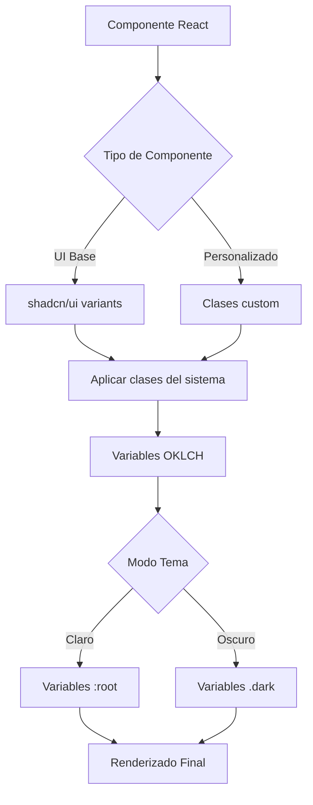

# Documento de Diseño

## Visión General

Este diseño especifica las mejoras de consistencia visual entre la página principal y el dashboard de la aplicación de ingeniería hidráulica. El enfoque es aplicar el sistema de diseño existente de manera uniforme sin modificar el layout actual, mejorando la jerarquía visual, el espaciado y asegurando que todos los componentes UI sean consistentes.

### Objetivos

1. Unificar la aplicación de estilos del sistema de diseño en ambas páginas
2. Estandarizar componentes UI (Button, Card, Badge) con los mismos estilos
3. Mejorar la jerarquía visual y el espaciado siguiendo un sistema consistente
4. Asegurar transiciones y animaciones uniformes
5. Mantener la consistencia en modo claro y oscuro

### Alcance

- Página principal (`/`): frontend/src/app/page.tsx
- Dashboard (`/dashboard`): frontend/src/app/(dashboard)/dashboard/page.tsx
- Sistema de diseño: frontend/src/app/globals.css
- Componentes UI: frontend/src/components/ui/*
- Componentes personalizados: frontend/src/components/feature-card.tsx

**Fuera del alcance:**
- Modificación del layout o estructura de las páginas
- Creación de nuevos componentes
- Cambios en la funcionalidad existente

## Arquitectura

### Estructura del Sistema de Diseño

```
Sistema de Diseño (globals.css)
├── Variables OKLCH (modo claro/oscuro)
├── Efectos de Fondo
│   ├── water-bg (gradientes animados)
│   └── water-bubble (partículas flotantes)
├── Efectos de Tarjetas
│   ├── glass-card (glassmorphism)
│   └── stat-card-* (tarjetas estadísticas temáticas)
├── Gradientes
│   ├── text-gradient (texto)
│   └── btn-primary (botones)
├── Animaciones
│   ├── fade-in-up (entrada de elementos)
│   ├── waterFlow (fondo animado)
│   └── floatUp (burbujas)
└── Estados Interactivos
    ├── hover (transformaciones y sombras)
    └── focus (outline y ring)
```

### Flujo de Aplicación de Estilos



## Componentes e Interfaces

### 1. Sistema de Tokens de Diseño

#### Espaciado Consistente

```typescript
// Sistema de espaciado basado en múltiplos de 4px
const spacing = {
  section: {
    paddingY: 'py-16 md:py-20',      // 64px/80px
    marginBottom: 'mb-12 md:mb-16',   // 48px/64px
    gap: 'space-y-8'                  // 32px
  },
  card: {
    padding: 'p-5',                   // 20px
    gap: 'space-y-3',                 // 12px
    borderRadius: 'rounded-xl'        // 12px
  },
  element: {
    small: 'gap-1.5',                 // 6px
    medium: 'gap-3',                  // 12px
    large: 'gap-6'                    // 24px
  }
}
```

#### Jerarquía Tipográfica

```typescript
const typography = {
  hero: {
    title: 'text-4xl md:text-6xl lg:text-7xl font-bold tracking-tight',
    subtitle: 'text-lg md:text-xl text-muted-foreground/70'
  },
  section: {
    title: 'text-3xl md:text-4xl font-bold tracking-tight',
    subtitle: 'text-muted-foreground/60 text-sm md:text-base'
  },
  card: {
    title: 'text-base md:text-lg font-semibold',
    description: 'text-xs md:text-sm text-muted-foreground/70'
  },
  stat: {
    value: 'text-2xl md:text-3xl font-bold',
    label: 'text-xs font-medium text-muted-foreground uppercase tracking-wider',
    unit: 'text-xs font-normal text-muted-foreground'
  }
}
```

### 2. Componentes UI Estandarizados

#### Button Component

```typescript
interface ButtonStyles {
  primary: {
    base: 'btn-primary text-white rounded-xl h-11 md:h-12 px-6 md:px-8 font-semibold',
    hover: 'hover:shadow-lg hover:shadow-blue-500/40 hover:-translate-y-1',
    transition: 'transition-all duration-200'
  },
  outline: {
    base: 'rounded-xl h-11 md:h-12 px-6 md:px-8 border-border/30',
    hover: 'hover:text-foreground hover:border-border/50',
    transition: 'transition-all duration-200'
  }
}
```

#### Card Component

```typescript
interface CardStyles {
  glass: {
    base: 'glass-card rounded-xl md:rounded-2xl',
    border: 'border border-border/20',
    padding: 'p-5 md:p-6',
    hover: 'hover:border-primary/30 hover:shadow-lg',
    transition: 'transition-all duration-300'
  },
  stat: {
    base: 'stat-card bg-card/80 rounded-xl',
    padding: 'p-5',
    hover: 'hover:-translate-y-2 hover:shadow-xl',
    transition: 'transition-all duration-300'
  }
}
```

#### Badge Component

```typescript
interface BadgeStyles {
  outline: {
    base: 'text-[10px] border-border/30',
    padding: 'px-1.5 py-0.5',
    borderRadius: 'rounded-full'
  },
  themed: {
    blue: 'border-blue-500/30 text-blue-400',
    green: 'border-green-500/30 text-green-400',
    amber: 'border-amber-500/30 text-amber-400',
    purple: 'border-purple-500/30 text-purple-400',
    cyan: 'border-cyan-500/30 text-cyan-400'
  }
}
```

### 3. Stat Cards Temáticas

```typescript
interface StatCardConfig {
  colors: {
    blue: {
      gradient: 'linear-gradient(90deg, oklch(0.65 0.20 230), oklch(0.70 0.15 200))',
      text: 'text-blue-600 dark:text-blue-400',
      hover: 'hover:border-blue-500/30'
    },
    green: {
      gradient: 'linear-gradient(90deg, oklch(0.65 0.18 160), oklch(0.70 0.15 140))',
      text: 'text-green-600 dark:text-green-400',
      hover: 'hover:border-green-500/30'
    },
    amber: {
      gradient: 'linear-gradient(90deg, oklch(0.75 0.16 80), oklch(0.80 0.14 60))',
      text: 'text-amber-600 dark:text-amber-400',
      hover: 'hover:border-amber-500/30'
    },
    purple: {
      gradient: 'linear-gradient(90deg, oklch(0.60 0.22 300), oklch(0.65 0.18 280))',
      text: 'text-purple-600 dark:text-purple-400',
      hover: 'hover:border-purple-500/30'
    },
    cyan: {
      gradient: 'linear-gradient(90deg, oklch(0.70 0.15 200), oklch(0.75 0.12 180))',
      text: 'text-cyan-600 dark:text-cyan-400',
      hover: 'hover:border-cyan-500/30'
    }
  },
  structure: {
    wrapper: 'stat-card stat-card-{color} bg-card/80',
    content: 'p-5',
    label: 'text-xs font-medium text-muted-foreground uppercase tracking-wider',
    value: 'text-3xl font-bold mt-2 {colorText}',
    description: 'text-[10px] text-muted-foreground/60 mt-1'
  }
}
```

### 4. Animaciones y Transiciones

```typescript
interface AnimationConfig {
  fadeInUp: {
    base: 'animate-fade-in-up',
    delays: {
      1: 'animate-fade-in-up-delay-1',
      2: 'animate-fade-in-up-delay-2',
      3: 'animate-fade-in-up-delay-3'
    }
  },
  hover: {
    card: 'hover:-translate-y-2 hover:shadow-xl transition-all duration-300',
    button: 'hover:-translate-y-1 hover:shadow-lg transition-all duration-200',
    badge: 'hover:scale-105 transition-all duration-300'
  },
  background: {
    waterFlow: 'animation: waterFlow 15s ease-in-out infinite',
    floatUp: 'animation: floatUp linear infinite'
  }
}
```

## Modelos de Datos

### Configuración de Tema

```typescript
interface ThemeConfig {
  mode: 'light' | 'dark'
  colors: {
    oklch: {
      light: {
        background: 'oklch(1 0 0)',
        foreground: 'oklch(0.145 0 0)',
        primary: 'oklch(0.205 0 0)',
        // ... resto de variables
      },
      dark: {
        background: 'oklch(0.11 0.01 250)',
        foreground: 'oklch(0.93 0.01 250)',
        primary: 'oklch(0.65 0.18 230)',
        // ... resto de variables
      }
    }
  }
}
```

### Configuración de Componente

```typescript
interface ComponentConfig {
  type: 'button' | 'card' | 'badge' | 'stat-card'
  variant: string
  size?: 'xs' | 'sm' | 'default' | 'lg'
  color?: 'blue' | 'green' | 'amber' | 'purple' | 'cyan'
  styles: {
    base: string[]
    hover?: string[]
    focus?: string[]
    active?: string[]
  }
  animation?: {
    type: 'fade-in-up' | 'hover' | 'none'
    delay?: number
  }
}
```

### Estructura de Página

```typescript
interface PageStructure {
  sections: Section[]
  theme: ThemeConfig
  animations: AnimationConfig
}

interface Section {
  id: string
  type: 'hero' | 'stats' | 'features' | 'content'
  spacing: {
    paddingY: string
    marginBottom: string
    gap: string
  }
  components: ComponentConfig[]
}
```


## Propiedades de Corrección

Una propiedad es una característica o comportamiento que debe cumplirse en todas las ejecuciones válidas del sistema—esencialmente, una declaración formal sobre lo que el sistema debe hacer. Las propiedades sirven como puente entre las especificaciones legibles por humanos y las garantías de corrección verificables por máquinas.

### Reflexión de Propiedades

Después de analizar los 40 criterios de aceptación, se identificaron las siguientes redundancias:

**Redundancias Identificadas:**

1. Los criterios 1.1, 1.2, 1.3 (consistencia de componentes UI) pueden consolidarse en una propiedad más amplia sobre consistencia de clases CSS
2. Los criterios 2.1, 2.3, 2.4 (stat cards) se pueden combinar en una propiedad sobre estructura y comportamiento de stat cards
3. Los criterios 3.1, 3.2, 3.3, 3.4 (jerarquía y espaciado) se pueden unificar en una propiedad sobre sistema de espaciado
4. Los criterios 5.1, 5.2, 5.3 (animaciones y transiciones) se pueden consolidar en una propiedad sobre configuración de animaciones
5. Los criterios 6.1, 6.2, 6.3, 6.4 (gradientes) se pueden combinar en una propiedad sobre consistencia de gradientes
6. Los criterios 7.1, 7.2, 7.3, 7.4 (tarjetas de capacidades) se pueden unificar en una propiedad estructural
7. Los criterios 8.1, 8.2, 8.3, 8.4 (información normativa) se pueden consolidar en una propiedad sobre formato normativo
8. Los criterios 9.1, 9.2, 9.3 (modo oscuro) se pueden combinar en una propiedad sobre variables de tema
9. Los criterios 10.1, 10.2, 10.3, 10.4 (accesibilidad) se pueden unificar en una propiedad sobre estándares de accesibilidad

**Propiedades Finales:** Después de la consolidación, se mantienen 15 propiedades únicas que proporcionan valor de validación sin redundancia.

### Propiedad 1: Consistencia de Clases CSS en Componentes UI

*Para cualquier* componente UI del mismo tipo (Button, Card, Badge) renderizado en la Página_Principal o el Dashboard, las clases CSS aplicadas deben ser idénticas para el mismo variant y size.

**Valida: Requisitos 1.1, 1.2, 1.3**

### Propiedad 2: Duración y Easing de Transiciones Hover

*Para cualquier* componente UI con estado hover, la duración de transición debe ser consistente (0.2s para botones, 0.3s para cards) y usar la misma easing function (ease-in-out o ease).

**Valida: Requisitos 1.4, 5.2**

### Propiedad 3: Estructura y Comportamiento de Stat Cards

*Para cualquier* Stat_Card renderizada, debe tener: (1) un gradiente superior mediante ::before con el color temático correcto, (2) padding de p-5, (3) hover con translateY(-2px) y shadow-xl, y (4) estructura consistente de label, value y description.

**Valida: Requisitos 2.1, 2.3, 2.4**

### Propiedad 4: Consistencia de Hover entre Tarjetas

*Para cualquier* tarjeta (stat card o tarjeta normativa) en ambas páginas, el efecto hover debe aplicar la misma transición de border-color y box-shadow.

**Valida: Requisitos 2.2, 7.3, 8.4**

### Propiedad 5: Sistema de Espaciado Basado en Múltiplos de 4px

*Para cualquier* margen, padding o gap aplicado en secciones o componentes, el valor debe ser un múltiplo de 4px (0.25rem en Tailwind).

**Valida: Requisitos 3.1, 3.4**

### Propiedad 6: Jerarquía Tipográfica Consistente

*Para cualquier* elemento tipográfico del mismo nivel jerárquico (hero title, section title, card title, etc.), las clases de tamaño de fuente, peso y tracking deben ser idénticas en ambas páginas.

**Valida: Requisitos 3.2, 3.3**

### Propiedad 7: Animación de Burbujas de Agua

*Para cualquier* burbuja de agua renderizada en la Página_Principal, debe tener la clase water-bubble y la animación floatUp con duración entre 9s y 16s.

**Valida: Requisitos 4.3**

### Propiedad 8: Variables OKLCH de Tema

*Para cualquier* variable de color definida en el sistema de diseño, debe existir tanto en :root (modo claro) como en .dark (modo oscuro) usando el formato OKLCH.

**Valida: Requisitos 4.4, 9.1**

### Propiedad 9: Configuración de Animaciones Fade-In-Up

*Para cualquier* elemento con animación de entrada, debe usar una de las clases animate-fade-in-up con delay de 0s, 0.1s, 0.2s o 0.3s, y tener opacity: 0 inicial para delays mayores a 0.

**Valida: Requisitos 5.1**

### Propiedad 10: Transformaciones y Sombras en Elementos Interactivos

*Para cualquier* elemento interactivo con hover, debe aplicar al menos uno de: transform (translateY o scale) o box-shadow, con transition-all.

**Valida: Requisitos 5.3**

### Propiedad 11: Respeto a Prefers-Reduced-Motion

*Para todas* las animaciones definidas en el CSS, debe existir una media query @media (prefers-reduced-motion: reduce) que reduzca las duraciones a 0.01ms.

**Valida: Requisitos 5.4**

### Propiedad 12: Consistencia de Gradientes

*Para cualquier* gradiente aplicado (text-gradient o btn-primary), debe usar los mismos valores OKLCH en ambas páginas y mantener los mismos valores de hue y chroma en modo claro y oscuro.

**Valida: Requisitos 6.1, 6.2, 6.3, 6.4**

### Propiedad 13: Estructura de Tarjetas de Capacidades

*Para cualquier* tarjeta de capacidades, debe tener la estructura: icono (w-10 h-10 o w-16 h-16), título (text-sm o text-xl font-semibold), descripción (text-xs text-muted-foreground), y badges con colores temáticos.

**Valida: Requisitos 7.1, 7.2, 7.4**

### Propiedad 14: Formato de Información Normativa

*Para cualquier* valor normativo mostrado, debe tener: número grande (text-2xl o text-3xl font-bold) con color temático, unidad (text-xs text-muted-foreground), y badge de norma (variant outline).

**Valida: Requisitos 8.1, 8.2, 8.3**

### Propiedad 15: Variables de Glass Card en Modo Oscuro

*Para cualquier* glass-card en modo oscuro, debe usar background: oklch(0.15 0.02 250 / 60%) y border: oklch(1 0 0 / 8%).

**Valida: Requisitos 9.2**

### Propiedad 16: Preservación de Hue y Chroma en Modo Oscuro

*Para cualquier* color temático (blue, green, amber, purple, cyan), el modo oscuro debe mantener el mismo hue (±5 grados) y chroma (±0.02) que el modo claro, ajustando solo la luminosidad.

**Valida: Requisitos 9.3**

### Propiedad 17: Outline de Focus

*Para cualquier* elemento que recibe focus, debe aplicar outline: 2px solid oklch(0.65 0.18 230) con outline-offset: 2px.

**Valida: Requisitos 10.1**

### Propiedad 18: Feedback Visual en Hover

*Para cualquier* elemento interactivo, el estado hover debe proporcionar feedback visual mediante al menos uno de: cambio de color, transform, o box-shadow.

**Valida: Requisitos 10.2**

### Propiedad 19: Contraste de Color Mínimo

*Para cualquier* texto renderizado sobre un fondo, el contraste debe ser al menos 4.5:1 para texto normal (< 18pt) y 3:1 para texto grande (≥ 18pt o ≥ 14pt bold).

**Valida: Requisitos 10.3**

### Propiedad 20: Área de Click Mínima

*Para cualquier* elemento interactivo (botón, enlace, input), el área de click debe ser al menos 44x44px según WCAG 2.1 Level AA.

**Valida: Requisitos 10.4**

## Manejo de Errores

### Estrategia de Degradación Elegante

1. **Fallback de Animaciones**: Si prefers-reduced-motion está activo, todas las animaciones se reducen a transiciones instantáneas
2. **Fallback de Colores**: Si OKLCH no es soportado, el navegador debe usar los valores RGB/HSL equivalentes
3. **Fallback de Backdrop-Filter**: Si backdrop-filter no es soportado, usar background sólido con opacidad

### Validación de Estilos

```typescript
interface StyleValidation {
  validateComponent(component: ComponentConfig): ValidationResult {
    const errors: string[] = []
    
    // Validar que las clases existen en el sistema de diseño
    if (!this.designSystem.hasClass(component.styles.base)) {
      errors.push(`Class ${component.styles.base} not found in design system`)
    }
    
    // Validar consistencia de espaciado (múltiplos de 4px)
    const spacing = this.extractSpacing(component.styles.base)
    if (spacing % 4 !== 0) {
      errors.push(`Spacing ${spacing}px is not a multiple of 4px`)
    }
    
    // Validar contraste de colores
    const contrast = this.calculateContrast(component.color, component.background)
    if (contrast < 4.5) {
      errors.push(`Contrast ratio ${contrast} is below 4.5:1 minimum`)
    }
    
    return {
      valid: errors.length === 0,
      errors
    }
  }
}
```

### Casos de Error Comunes

1. **Clase CSS no definida**: Advertir en desarrollo, usar fallback en producción
2. **Variable OKLCH no definida**: Usar valor por defecto del tema
3. **Animación no soportada**: Desactivar animación, mantener estado final
4. **Contraste insuficiente**: Ajustar automáticamente la luminosidad del color

## Estrategia de Testing

### Enfoque Dual de Testing

Este proyecto requiere tanto pruebas unitarias como pruebas basadas en propiedades para garantizar la corrección completa:

**Pruebas Unitarias:**
- Verificar ejemplos específicos de componentes renderizados
- Validar casos edge como modo oscuro, diferentes tamaños de pantalla
- Probar integración entre componentes
- Verificar condiciones de error y fallbacks

**Pruebas Basadas en Propiedades:**
- Verificar propiedades universales en múltiples instancias generadas aleatoriamente
- Validar consistencia de estilos en diferentes contextos
- Probar invariantes del sistema de diseño
- Ejecutar mínimo 100 iteraciones por propiedad

### Configuración de Property-Based Testing

Para TypeScript/React, usaremos **fast-check** como biblioteca de property-based testing:

```bash
npm install --save-dev fast-check @testing-library/react @testing-library/jest-dom
```

### Estructura de Tests

```typescript
import fc from 'fast-check'
import { render } from '@testing-library/react'

describe('Design System Properties', () => {
  // Propiedad 1: Consistencia de Clases CSS
  it('should apply identical CSS classes for same component type and variant', () => {
    fc.assert(
      fc.property(
        fc.constantFrom('primary', 'outline', 'ghost'),
        fc.constantFrom('sm', 'default', 'lg'),
        (variant, size) => {
          // Feature: mejora-diseno-consistente, Property 1: Para cualquier componente UI del mismo tipo renderizado en la Página_Principal o el Dashboard, las clases CSS aplicadas deben ser idénticas
          const buttonHome = render(<Button variant={variant} size={size} />)
          const buttonDashboard = render(<Button variant={variant} size={size} />)
          
          const classesHome = buttonHome.container.firstChild?.className
          const classesDashboard = buttonDashboard.container.firstChild?.className
          
          expect(classesHome).toBe(classesDashboard)
        }
      ),
      { numRuns: 100 }
    )
  })
  
  // Propiedad 5: Sistema de Espaciado
  it('should use spacing values that are multiples of 4px', () => {
    fc.assert(
      fc.property(
        fc.array(fc.constantFrom('p-1', 'p-2', 'p-3', 'p-4', 'p-5', 'p-6', 'p-8', 'p-10', 'p-12')),
        (spacingClasses) => {
          // Feature: mejora-diseno-consistente, Property 5: Para cualquier margen, padding o gap, el valor debe ser múltiplo de 4px
          spacingClasses.forEach(className => {
            const value = extractSpacingValue(className)
            expect(value % 4).toBe(0)
          })
        }
      ),
      { numRuns: 100 }
    )
  })
})
```

### Tests Unitarios Complementarios

```typescript
describe('Component Consistency', () => {
  it('should render primary button with correct styles on home page', () => {
    const { container } = render(<Button className="btn-primary" />)
    const button = container.firstChild
    
    expect(button).toHaveClass('btn-primary')
    expect(button).toHaveClass('rounded-xl')
    expect(button).toHaveClass('h-11', 'md:h-12')
  })
  
  it('should apply glass-card effect in dark mode', () => {
    const { container } = render(
      <div className="dark">
        <Card className="glass-card" />
      </div>
    )
    
    const card = container.querySelector('.glass-card')
    const styles = window.getComputedStyle(card!)
    
    expect(styles.background).toContain('oklch(0.15 0.02 250 / 60%)')
    expect(styles.border).toContain('oklch(1 0 0 / 8%)')
  })
  
  it('should respect prefers-reduced-motion', () => {
    // Simular prefers-reduced-motion
    window.matchMedia = jest.fn().mockImplementation(query => ({
      matches: query === '(prefers-reduced-motion: reduce)',
      media: query,
      addEventListener: jest.fn(),
      removeEventListener: jest.fn(),
    }))
    
    const { container } = render(<div className="animate-fade-in-up" />)
    const element = container.firstChild
    const styles = window.getComputedStyle(element!)
    
    expect(styles.animationDuration).toBe('0.01ms')
  })
})
```

### Cobertura de Testing

- **Propiedades de Corrección**: 20 propiedades → 20 property-based tests
- **Casos Edge**: ~15 unit tests para casos específicos
- **Integración**: ~10 unit tests para interacción entre componentes
- **Accesibilidad**: ~8 unit tests para WCAG compliance

**Total estimado**: 20 property tests + 33 unit tests = 53 tests

### Herramientas de Testing Visual

Para validar la consistencia visual, se recomienda usar:

1. **Chromatic** o **Percy**: Para visual regression testing
2. **Storybook**: Para documentar y probar componentes aislados
3. **axe-core**: Para testing automatizado de accesibilidad

### Ejecución de Tests

```bash
# Ejecutar todos los tests
npm test

# Ejecutar solo property-based tests
npm test -- --testNamePattern="Properties"

# Ejecutar con cobertura
npm test -- --coverage

# Ejecutar tests de accesibilidad
npm test -- --testNamePattern="Accessibility"
```

### Criterios de Aceptación de Tests

- Todas las propiedades deben pasar con 100 iteraciones
- Cobertura de código mínima: 80%
- Todos los tests de accesibilidad deben pasar
- No debe haber regresiones visuales en Chromatic/Percy
